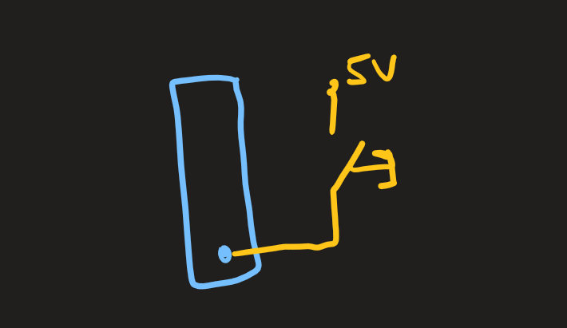

Tasten sind eine Eingabe des Benutzers auf einfachster Hardware-Ebene. Die Taste kann entweder gedrückt sein oder eben nicht. Diese binäre Zustandsoption ermöglicht das einfache Konvertieren in "Strom an" oder "Strom aus".

## Theorie

Grundsätzlich gibt es zwei verschiedene Arten, Tasten zu verwenden:

-   Active Low Beschaltung => Pull-Up Widerstand
-   Active High Beschaltung => Pull-Down Widerstand

Diese beiden Arten müssen auf [Code-Ebene](#code) unterschiedlich verarbeitet werden.

### Active Low / Pull-Up

Bei der Active Low Beschaltung liegen 5V Spannung (active) am Eingang an, wenn die Taste gedrückt ist (low). Der [Aufbau](#active-low--pull-up-1) einer Active Low Beschaltung verwendet den Pull-Up Widerstand.

### Active High / Pull-Down

Active High Beschaltungen funktionieren genau anders herum. Hierbei liegen die 5V Spannung (active) am Eingang an, wenn die Taste **nicht** gedrückt ist (high). Der [Aufbau](#active-high--pull-down-1) einer Active High Beschaltung verwendet den Pull-Down Widerstand.

## Aufbau

### Active Low / Pull-Up

Am korrespondierendem PIN baut man einen Spannungsteiler auf, welcher auf der einen Seite einen 10K Widerstand mit 5V Versorgungsspannung und auf der anderen Seite eine gegroundete Taste anliegen hat.


_Ein Pull-Up Widerstand Aufbau, wenn die Taste geöffnet ist_


_Ein Pull-Up Widerstand Aufbau, wenn die Taste geschlossen ist_

### Active High / Pull-Down

Am korrespondierendem PIN liegt wieder ein Spannungsteiler an, welcher diesmal allerdings auf der Seite des 10K Widerstandes den Ground (GRN) hat und auf der anderen Seite befindet sich die Taste mit 5V Versorgungsspannnung.


_Ein Pull-Down Widerstand Aufbau, wenn die Taste geöffnet ist_


_Ein Pull-Down Widerstand Aufbau, wenn die Taste geschlossen ist_

## Code

### ohne Interrupts

:::note
Achte genau auf die Unterschiede der if-Bedingungen!
:::

#### Pull-Up Beschaltung

```c
#include <avr/io.h>
#include <util/delay.h>

void checkButton(void);

int main(void)
{
    // Taste an Port B, Pin 0
    //  Port B, Pin 0 als Eingang konfigurieren
	DDRB &= ~(1<<DDB0);

	while (1)
	{
		checkButton();
	}
}

void checkButton(void) {
    // Überprüfen, ob die Taste gedrückt wird.
	if (PINB & (1<<PINB0))
	{
		// Taste wurde 1x gedrückt
	}

    // Prellen vermeiden
	_delay_ms(70);
}
```

#### Pull-Down Beschaltung

```c
#include <avr/io.h>
#include <util/delay.h>

void checkButton(void);

int main(void)
{
    // Taste an Port B, Pin 0
    //  Port B, Pin 0 als Eingang konfigurieren
	DDRB &= ~(1<<DDB0);

	while (1)
	{
		checkButton();
	}
}

void checkButton(void) {
    // Überprüfen, ob die Taste gedrückt wird.
	if (!(PINB & (1<<PINB0)))
	{
		// Taste wurde 1x gedrückt
	}

    // Prellen vermeiden
	_delay_ms(70);
}
```

#### interner Pull-Up Widerstand

```c
#include <avr/io.h>
#include <util/delay.h>

void checkButton(void);

int main(void)
{
    // Taste an Port B, Pin 0
    //  Port B, Pin 0 als Eingang konfigurieren
	DDRB &= ~(1<<DDB0);

    //  Port B, Pin 0 Spannung: 5V (internen Pull-Up Widerstand aktivieren)
	PORTB |= (1<<PORTB0);

	while (1)
	{
		checkButton();
	}
}

void checkButton(void) {
    // Überprüfen, ob die Taste gedrückt wird.
	if (!(PINB & (1<<PINB0)))
	{
		// Taste wurde 1x gedrückt
	}

    // Prellen vermeiden
	_delay_ms(70);
}
```

### mit Interrupts

Mit Interrupts hat man den Vorteil, dass man nicht in der while-Schleife ständig eine Methode aufrufen muss, welche die Tasten abfragt. Dieses Verhalten wird bei den [Interrupts]() noch besser erklärt.

#### direkt externe Interrupts

An Port D gibt es zwei PINs (2 und 3), welche über direkte externe Interrupts - Funktionalitäten verfügen. Das bedeutet, dass dort angeschlossene Tasten spezifisch mithilfe von bereits definierten Interrupts überprüft werden können. Dies erspart ein wenig komplexen Programmcode.

```c
#include <avr/io.h>
#include <util/delay.h>
#include <avr/interrupt.h>

int main(void)
{
    // Taste an Port D, Pin 2
    //  Port D, Pin 2 als Eingang konfigurieren
	DDRD &= ~(1<<DDD2);

    //  Port D, Pin 2 Spannung: 5V (internen Pull-Up Widerstand aktivieren)
	PORTD |= (1<<PORTD2);

    // Interrupt
    //  direktes externe Interrupt an Port D, Pin 2 aktivieren
    EIMSK |= (1<<INT0);

    //  Set Enable Interrupt
    sei();

	while (1)
	{
	}
}

ISR (INT0_vect) {
    // Taste wurde 1x gedrückt

    _delay_ms(70);
}
```

#### gruppenbasierte externe Interrupts

Die gruppenbasierten externen Interrupts gelten immer für den gesamten Port. Aus diesem Grund muss man im Interrupt auch nochmals den richtigen PIN auf Tasteneingaben überprüfen, wie man unten, im Code, sehen kann.

|       | Port B        | Port C         | Port D         |
| ----- | ------------- | -------------- | -------------- |
| PIN 0 | PCIE0, PCINT0 | PCIE1, PCINT8  | PCIE2, PCINT16 |
| PIN 1 | PCIE0, PCINT1 | PCIE1, PCINT9  | PCIE2, PCINT17 |
| PIN 2 | PCIE0, PCINT2 | PCIE1, PCINT10 | PCIE2, PCINT18 |
| PIN 3 | PCIE0, PCINT3 | PCIE1, PCINT11 | PCIE2, PCINT19 |
| PIN 4 | PCIE0, PCINT4 | PCIE1, PCINT12 | PCIE2, PCINT20 |
| PIN 5 | PCIE0, PCINT5 | PCIE1, PCINT13 | PCIE2, PCINT21 |
| PIN 6 | PCIE0, PCINT6 | PCIE1, PCINT14 | PCIE2, PCINT22 |
| PIN 7 | PCIE0, PCINT7 | PCIE1, PCINT15 | PCIE2, PCINT23 |

```c
#include <avr/io.h>
#include <util/delay.h>
#include <avr/interrupt.h>

int main(void)
{
    // Taste an Port D, Pin 4
    //  Port D, Pin 4 als Eingang konfigurieren
	DDRD &= ~(1<<DDD4);

    //  Port D, Pin 4 Spannung: 5V (internen Pull-Up Widerstand aktivieren)
	PORTD |= (1<<PORTD4);

    // Interrupt
    //  gruppenbasiertes externe Interrupt an Port D, Pin 4 aktivieren
    PCICR |= (1<<PCIE2);
	PCMSK2 |= (1<<PCINT20);

    //  Set Enable Interrupt
    sei();

	while (1)
	{
	}
}

ISR (PCINT2_vect) {
    // notwendige Überprüfung des spezifischen PINs 4 auf Port D
    //  aufgrund der Verwendung von gruppenbasierten Interrupts
	if(!(PIND & (1<<PIND4))){
        // Taste wurde 1x gedrückt
	}

    _delay_ms(70);
}
```

## Troubleshooting

### Floating Point

Ohne Widerstand darf man keine 5V Versorgungsspannung auf der Taste anlegen:



### Kurzschluss

Ebenso darf ein Spannungsteiler nicht einfach an den Ground (GND) angeschlossen werden, da diesr Ground sofort die Versorgungsspannung aufheben würde.


