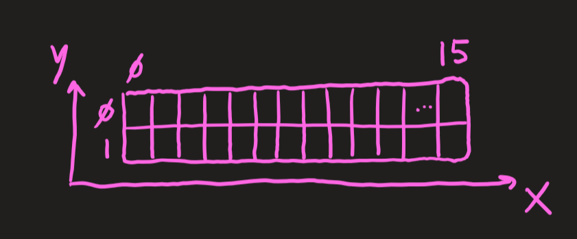

Das Liquid Crystal Display besteht aus 16 Zeichen in einer Reihe und 2 Zeilen insgesamt. Es unterstützt die gesamten lateinischen, chinesischen und weiter Zeichensätze plus einige Emojis.

Für die Verwendung des Display empfiehlt sich [lcd.h](#appendix-a---lcdh) und [lcd.c](#appendix-b---lcdc).

## Aufbau




## Code

Das LCD hat einige Möglichkeiten, Zeichen zu verändern, zu löschen und hinzuzufügen.

### Schreibe Zeichen

Man kann einzelne Zeichen mit `lcd_putc('s')` aufs Display schreiben oder einen ganzen String:

```c
lcd_puts("trueberryless");
```

### Display clearn

Um alle Zeichen auf dem Display wieder zu löschen:

```c
lcd_clrscr();
```

### Bewege Zeichen

Wenn man alle Zeichen um eins nach links bewegen möchte, kann man das machen:

```c
lcd_command(LCD_MOVE_DISP_LEFT);
```

Dies ist äußerst hilfreich, wenn ein Text übers Display laufen soll.

### Example Project

```c
#define F_CPU 16000000

#include <avr/io.h>
#include <stdio.h>
#include <stdlib.h>
#include <avr/io.h>
#include <avr/interrupt.h>

#define __DELAY_BACKWARD_COMPATIBLE__
#include <util/delay.h>

#include "lcd.h"
#include "dht.h"


int main(void)
{
    char buffer[16];

    int8_t temperature = 0;
    int8_t humidity = 0;

    lcd_init(LCD_DISP_ON);

    while(1) {
	    if (dht_gettemperaturehumidity(&temperature, &humidity) != -1) {
			sprintf(buffer, "T: %u C, H: %u", temperature, humidity);
			lcd_puts(buffer);
			lcd_puts("%");
		}
        else {
			lcd_puts("Error");
	    }
	    _delay_ms(2000);
		lcd_clrscr();
    }
}
```

## Appendices

### Appendix A - lcd.h

```c
#ifndef LCD_H
#define LCD_H
/*************************************************************************
 Title	:   C include file for the HD44780U LCD library (lcd.c)
 Author:    Peter Fleury <pfleury@gmx.ch>  http://jump.to/fleury
 File:	    $Id: lcd.h,v 1.12 2003/12/10 22:13:43 peter Exp $
 Software:  AVR-GCC 3.3
 Hardware:  any AVR device, memory mapped mode only for AT90S4414/8515/Mega
***************************************************************************/

/**
 @defgroup pfleury_lcd LCD library
 @code #include <lcd.h> @endcode

 @brief Basic routines for interfacing a HD44780U-based text LCD display

 Originally based on Volker Oth's LCD library,
 changed lcd_init(), added additional constants for lcd_command(),
 added 4-bit I/O mode, improved and optimized code.

 Library can be operated in memory mapped mode (LCD_IO_MODE=0) or in
 4-bit IO port mode (LCD_IO_MODE=1). 8-bit IO port mode not supported.

 Memory mapped mode compatible with Kanda STK200, but supports also
 generation of R/W signal through A8 address line.

 @author Peter Fleury pfleury@gmx.ch http://jump.to/fleury

 @see The chapter <a href="http://www.mysunrise.ch/users/pfleury/avr-lcd44780.html" target="_blank">Interfacing a HD44780 Based LCD to an AVR</a>
      on my home page.

*/

/*@{*/

#if (__GNUC__ * 100 + __GNUC_MINOR__) < 303
#error "This library requires AVR-GCC 3.3 or later, update to newer AVR-GCC compiler !"
#endif

#include <inttypes.h>
#include <avr/pgmspace.h>


/**
 *  @name  Definitions for Display Size
 *  Change these definitions to adapt setting to your display
*/
#define LCD_LINES           2     /**< number of visible lines of the display */
#define LCD_DISP_LENGTH    16     /**< visibles characters per line of the display */
#define LCD_LINE_LENGTH    40     /**< internal line length of the display    */
#define LCD_START_LINE1  0x00     /**< DDRAM address of first char of line 1 */
#define LCD_START_LINE2  0x40     /**< DDRAM address of first char of line 2 */
#define LCD_START_LINE3  0x14     /**< DDRAM address of first char of line 3 */
#define LCD_START_LINE4  0x54     /**< DDRAM address of first char of line 4 */
#define LCD_WRAP_LINES      0     /**< 0: no wrap, 1: wrap at end of visibile line */


#define LCD_IO_MODE      1         /**< 0: memory mapped mode, 1: IO port mode */
#if LCD_IO_MODE
/**
 *  @name Definitions for 4-bit IO mode
 *  Change LCD_PORT if you want to use a different port
 */
#define LCD_DATA_PORT    PORTD     /**< port for 4bit data (Pin 4..7) */
#define LCD_RS_PORT      PORTC     /**< port for RS line */
#define LCD_RS_PIN       0         /**< pin  for RS line */
#define LCD_RW_PORT      PORTC     /**< port for RW line */
#define LCD_RW_PIN       1         /**< pin  for RW line */
#define LCD_E_PORT       PORTC     /**< port for Enable line */
#define LCD_E_PIN        2         /**< pin  for Enable line */

#elif defined(__AVR_AT90S4414__) || defined(__AVR_AT90S8515__) || defined(__AVR_ATmega64__) || \
      defined(__AVR_ATmega8515__)|| defined(__AVR_ATmega103__) || defined(__AVR_ATmega128__) || \
      defined(__AVR_ATmega161__) || defined(__AVR_ATmega162__)
/*
 *  memory mapped mode is only supported when the device has an external data memory interface
 */
#define LCD_IO_DATA      0xC000    /* A15=E=1, A14=RS=1                 */
#define LCD_IO_FUNCTION  0x8000    /* A15=E=1, A14=RS=0                 */
#define LCD_IO_READ      0x0100    /* A8 =R/W=1 (R/W: 1=Read, 0=Write   */
#else
#error "external data memory interface not available for this device, use 4-bit IO port mode"

#endif


/**
 *  @name Definitions for LCD command instructions
 *  The constants define the various LCD controller instructions which can be passed to the
 *  function lcd_command(), see HD44780 data sheet for a complete description.
 */

/* instruction register bit positions, see HD44780U data sheet */
#define LCD_CLR               0      /* DB0: clear display                  */
#define LCD_HOME              1      /* DB1: return to home position        */
#define LCD_ENTRY_MODE        2      /* DB2: set entry mode                 */
#define LCD_ENTRY_MODE_INC    1      /*   DB1: 1=increment, 0=decrement     */
#define LCD_ENTRY_MODE_SHIFT  0      /*   DB2: 1=display shift on           */
#define LCD_ON                3      /* DB3: turn lcd/cursor on             */
#define LCD_ON_DISPLAY        2      /*   DB2: turn display on              */
#define LCD_ON_CURSOR         1      /*   DB1: turn cursor on               */
#define LCD_ON_BLINK          0      /*     DB0: blinking cursor ?          */
#define LCD_MOVE              4      /* DB4: move cursor/display            */
#define LCD_MOVE_DISP         3      /*   DB3: move display (0-> cursor) ?  */
#define LCD_MOVE_RIGHT        2      /*   DB2: move right (0-> left) ?      */
#define LCD_FUNCTION          5      /* DB5: function set                   */
#define LCD_FUNCTION_8BIT     4      /*   DB4: set 8BIT mode (0->4BIT mode) */
#define LCD_FUNCTION_2LINES   3      /*   DB3: two lines (0->one line)      */
#define LCD_FUNCTION_10DOTS   2      /*   DB2: 5x10 font (0->5x7 font)      */
#define LCD_CGRAM             6      /* DB6: set CG RAM address             */
#define LCD_DDRAM             7      /* DB7: set DD RAM address             */
#define LCD_BUSY              7      /* DB7: LCD is busy                    */

/* set entry mode: display shift on/off, dec/inc cursor move direction */
#define LCD_ENTRY_DEC            0x04   /* display shift off, dec cursor move dir */
#define LCD_ENTRY_DEC_SHIFT      0x05   /* display shift on,  dec cursor move dir */
#define LCD_ENTRY_INC            0x06   /* display shift off, inc cursor move dir */
#define LCD_ENTRY_INC_SHIFT      0x07   /* display shift on,  inc cursor move dir */

/* display on/off, cursor on/off, blinking char at cursor position */
#define LCD_DISP_OFF             0x08   /* display off                            */
#define LCD_DISP_ON              0x0C   /* display on, cursor off                 */
#define LCD_DISP_ON_BLINK        0x0D   /* display on, cursor off, blink char     */
#define LCD_DISP_ON_CURSOR       0x0E   /* display on, cursor on                  */
#define LCD_DISP_ON_CURSOR_BLINK 0x0F   /* display on, cursor on, blink char      */

/* move cursor/shift display */
#define LCD_MOVE_CURSOR_LEFT     0x10   /* move cursor left  (decrement)          */
#define LCD_MOVE_CURSOR_RIGHT    0x14   /* move cursor right (increment)          */
#define LCD_MOVE_DISP_LEFT       0x18   /* shift display left                     */
#define LCD_MOVE_DISP_RIGHT      0x1C   /* shift display right                    */

/* function set: set interface data length and number of display lines */
#define LCD_FUNCTION_4BIT_1LINE  0x20   /* 4-bit interface, single line, 5x7 dots */
#define LCD_FUNCTION_4BIT_2LINES 0x28   /* 4-bit interface, dual line,   5x7 dots */
#define LCD_FUNCTION_8BIT_1LINE  0x30   /* 8-bit interface, single line, 5x7 dots */
#define LCD_FUNCTION_8BIT_2LINES 0x38   /* 8-bit interface, dual line,   5x7 dots */


#define LCD_MODE_DEFAULT     LCD_ENTRY_INC


/**
 *  @name Functions
 */


/**
 @brief    Initialize display and select type of cursor
 @param    dispAttr \b LCD_DISP_OFF display off\n
                    \b LCD_DISP_ON display on, cursor off\n
                    \b LCD_DISP_ON_CURSOR display on, cursor on\n
                    \b LCD_DISP_ON_CURSOR_BLINK display on, cursor on flashing
 @return  none
*/
extern void lcd_init(uint8_t dispAttr);


/**
 @brief    Clear display and set cursor to home position
 @param    void
 @return   none
*/
extern void lcd_clrscr(void);


/**
 @brief    Set cursor to home position
 @param    void
 @return   none
*/
extern void lcd_home(void);


/**
 @brief    Set cursor to specified position

 @param    x horizontal position\n (0: left most position)
 @param    y vertical position\n   (0: first line)
 @return   none
*/
extern void lcd_gotoxy(uint8_t x, uint8_t y);


/**
 @brief    Display character at current cursor position
 @param    c character to be displayed
 @return   none
*/
extern void lcd_putc(char c);


/**
 @brief    Display string without auto linefeed
 @param    s string to be displayed
 @return   none
*/
extern void lcd_puts(const char *s);


/**
 @brief    Display string from program memory without auto linefeed
 @param    s string from program memory be be displayed
 @return   none
 @see      lcd_puts_P
*/
extern void lcd_puts_p(const char *progmem_s);


/**
 @brief    Send LCD controller instruction command
 @param    cmd instruction to send to LCD controller, see HD44780 data sheet
 @return   none
*/
extern void lcd_command(uint8_t cmd);

extern void lcd_data(uint8_t dat);

extern int lcd_getxy(void);

/**
 @brief macros for automatically storing string constant in program memory
*/
#define lcd_puts_P(__s)         lcd_puts_p(PSTR(__s))

/*@}*/
#endif //LCD_H
```

### Appendix B - lcd.c

```c
/****************************************************************************
 Title	:   HD44780U LCD library
 Author:    Peter Fleury <pfleury@gmx.ch>  http://jump.to/fleury
 File:	    $Id: lcd.c,v 1.13 2003/07/13 07:33:10 peter Exp $
 Software:  AVR-GCC 3.3
 Target:    any AVR device, memory mapped mode only for AT90S4414/8515/Mega

 DESCRIPTION
       Basic routines for interfacing a HD44780U-based text lcd display

       Originally based on Volker Oth's lcd library,
       changed lcd_init(), added additional constants for lcd_command(),
       added 4-bit I/O mode, improved and optimized code.

       Library can be operated in memory mapped mode (LCD_IO_MODE=0) or in
       4-bit IO port mode (LCD_IO_MODE=1). 8-bit IO port mode not supported.

       Memory mapped mode compatible with Kanda STK200, but supports also
       generation of R/W signal through A8 address line.

 USAGE
       See the C include lcd.h file for a description of each function

*****************************************************************************/
#include <inttypes.h>
#include <avr/io.h>
#include <avr/pgmspace.h>
#include "lcd.h"


/*
** constants/macros
*/
#define PIN(x) (*(&x - 2))  /* address of data direction register of port x */
#define DDR(x) (*(&x - 1))  /* address of input register of port x          */


#if LCD_IO_MODE
#define lcd_e_delay()   __asm__ __volatile__( "rjmp 1f\n 1:" );
#define lcd_e_high()    LCD_E_PORT  |=  _BV(LCD_E_PIN);
#define lcd_e_low()     LCD_E_PORT  &= ~_BV(LCD_E_PIN);
#define lcd_e_toggle()  toggle_e()
#define lcd_rw_high()   LCD_RW_PORT |=  _BV(LCD_RW_PIN)
#define lcd_rw_low()    LCD_RW_PORT &= ~_BV(LCD_RW_PIN)
#define lcd_rs_high()   LCD_RS_PORT |=  _BV(LCD_RS_PIN)
#define lcd_rs_low()    LCD_RS_PORT &= ~_BV(LCD_RS_PIN)
#define set_data(nib)   LCD_DATA_PORT = (LCD_DATA_PORT & 0x0f) | (nib)
#endif

#if LCD_IO_MODE
#if LCD_LINES==1
#define LCD_FUNCTION_DEFAULT    LCD_FUNCTION_4BIT_1LINE
#else
#define LCD_FUNCTION_DEFAULT    LCD_FUNCTION_4BIT_2LINES
#endif
#else
#if LCD_LINES==1
#define LCD_FUNCTION_DEFAULT    LCD_FUNCTION_8BIT_1LINE
#else
#define LCD_FUNCTION_DEFAULT    LCD_FUNCTION_8BIT_2LINES
#endif
#endif


/*
** function prototypes
*/
static void delay(uint16_t us);
#if LCD_IO_MODE
static void toggle_e(void);
#endif

/*
** local functions
*/

/*************************************************************************
delay for a minimum of <us> microseconds
with a 4Mhz crystal, the resolution is 1 us
*************************************************************************/
static void delay(uint16_t us)
{
#ifndef FASTSIM
    while ( us ) us--;
#endif
}


#if LCD_IO_MODE
/* toggle Enable Pin to initiate write */
static void toggle_e(void)
{
    lcd_e_high();
    lcd_e_delay();
    lcd_e_low();
}
#endif


/*************************************************************************
Low-level function to write byte to LCD controller
Input:    data   byte to write to LCD
          rs     1: write data
                 0: write instruction
Returns:  none
*************************************************************************/
#if LCD_IO_MODE
static void lcd_write(uint8_t data,uint8_t rs)
{
    /* configure data pins as output */
    DDR(LCD_DATA_PORT) |= 0xF0;
    lcd_rw_low();

    if (rs) {   /* write data        (RS=1, RW=0) */

       lcd_rs_high();

    } else {    /* write instruction (RS=0, RW=0) */

       lcd_rs_low();
    }

    /* output high nibble first */
    set_data(data & 0xF0);
    lcd_e_toggle();

    /* output low nibble */
    set_data((data<<4)&0xF0);
    lcd_e_toggle();

    /* all data pins high (inactive) */
    set_data(0xF0);
}
#else
#define lcd_write(d,rs) if (rs) *(volatile uint8_t*)(LCD_IO_DATA) = d; else *(volatile uint8_t*)(LCD_IO_FUNCTION) = d;
/* rs==0 -> write instruction to LCD_IO_FUNCTION */
/* rs==1 -> write data to LCD_IO_DATA */
#endif


/*************************************************************************
Low-level function to read byte from LCD controller
Input:    rs     1: read data
                 0: read busy flag / address counter
Returns:  byte read from LCD controller
*************************************************************************/
#if LCD_IO_MODE
static uint8_t lcd_read(uint8_t rs)
{
    register uint8_t dataH, dataL;

    if (rs)
        lcd_rs_high();                       /* RS=1: read data      */
    else
        lcd_rs_low();                        /* RS=0: read busy flag */
    lcd_rw_high();                           /* RW=1  read mode      */

    /* configure data pins as input */
    DDR(LCD_DATA_PORT) &= 0x0f;

    lcd_e_high();
    lcd_e_delay();
    dataH = PIN(LCD_DATA_PORT);              /* read high nibble first */
    lcd_e_low();

    lcd_e_delay();                           /* Enable 500ns low       */

    lcd_e_high();
    lcd_e_delay();
    dataL = PIN(LCD_DATA_PORT);              /* read low nibble        */
    lcd_e_low();

    return ( (dataH&0xf0) | (dataL>>4) );
}
#else
#define lcd_read(rs) (rs) ? *(volatile uint8_t*)(LCD_IO_DATA+LCD_IO_READ) : *(volatile uint8_t*)(LCD_IO_FUNCTION+LCD_IO_READ)
/* rs==0 -> read instruction from LCD_IO_FUNCTION */
/* rs==1 -> read data from LCD_IO_DATA */
#endif


/*************************************************************************
loops while lcd is busy, returns address counter
*************************************************************************/
static uint8_t lcd_waitbusy(void)

{
    register uint8_t c;

    /* wait until busy flag is cleared */
    while ( (c=lcd_read(0)) & (1<<LCD_BUSY)) {}

    /* the address counter is updated 4us after the busy flag is cleared */
    delay(2);

    /* now read the address counter */
    return (lcd_read(0));  // return address counter

}/* lcd_waitbusy */


/*************************************************************************
Move cursor to the start of next line or to the first line if the cursor
is already on the last line.
*************************************************************************/
static void lcd_newline(uint8_t pos)
{
    register uint8_t addressCounter;


#if LCD_LINES==1
    addressCounter = 0;
#endif
#if LCD_LINES==2
    if ( pos < (LCD_START_LINE2) )
        addressCounter = LCD_START_LINE2;
    else
        addressCounter = LCD_START_LINE1;
#endif
#if LCD_LINES==4
    if ( pos < LCD_START_LINE3 )
        addressCounter = LCD_START_LINE2;
    else if ( (pos >= LCD_START_LINE2) && (pos < LCD_START_LINE4) )
        addressCounter = LCD_START_LINE3;
    else if ( (pos >= LCD_START_LINE3) && (pos < LCD_START_LINE2) )
        addressCounter = LCD_START_LINE4;
    else
        addressCounter = LCD_START_LINE1;
#endif
    lcd_command((1<<LCD_DDRAM)+addressCounter);

}/* lcd_newline */


/*
** PUBLIC FUNCTIONS
*/

/*************************************************************************
Send LCD controller instruction command
Input:   instruction to send to LCD controller, see HD44780 data sheet
Returns: none
*************************************************************************/
void lcd_command(uint8_t cmd)
{
    lcd_waitbusy();
    lcd_write(cmd,0);
}


/*************************************************************************
Send LCD controller data send
Input:   data to send to LCD controller, see HD44780 data sheet
Returns: none
*************************************************************************/
void lcd_data(uint8_t dat)
{
    lcd_waitbusy();
    lcd_write(dat,1);
}


/*************************************************************************
Set cursor to specified position
Input:    x  horizontal position  (0: left most position)
          y  vertical position    (0: first line)
Returns:  none
*************************************************************************/
void lcd_gotoxy(uint8_t x, uint8_t y)
{
#if LCD_LINES==1
    lcd_command((1<<LCD_DDRAM)+LCD_START_LINE1+x);
#endif
#if LCD_LINES==2
    if ( y==0 )
        lcd_command((1<<LCD_DDRAM)+LCD_START_LINE1+x);
    else
        lcd_command((1<<LCD_DDRAM)+LCD_START_LINE2+x);
#endif
#if LCD_LINES==4
    if ( y==0 )
        lcd_command((1<<LCD_DDRAM)+LCD_START_LINE1+x);
    else if ( y==1)
        lcd_command((1<<LCD_DDRAM)+LCD_START_LINE2+x);
    else if ( y==2)
        lcd_command((1<<LCD_DDRAM)+LCD_START_LINE3+x);
    else /* y==3 */
        lcd_command((1<<LCD_DDRAM)+LCD_START_LINE4+x);
#endif

}/* lcd_gotoxy */


/*************************************************************************
*************************************************************************/
int lcd_getxy(void)
{
    return lcd_waitbusy();
}


/*************************************************************************
Clear display and set cursor to home position
*************************************************************************/
void lcd_clrscr(void)
{
    lcd_command(1<<LCD_CLR);
}


/*************************************************************************
Set cursor to home position
*************************************************************************/
void lcd_home(void)
{
    lcd_command(1<<LCD_HOME);
}


/*************************************************************************
Display character at current cursor position
Input:    character to be displayed
Returns:  none
*************************************************************************/
void lcd_putc(char c)
{
    uint8_t pos;


    pos = lcd_waitbusy();   // read busy-flag and address counter
    if (c=='\n')
    {
        lcd_newline(pos);
    }
    else
    {
#if LCD_WRAP_LINES==1
#if LCD_LINES==1
        if ( pos == LCD_START_LINE1+LCD_DISP_LENGTH )
            lcd_write((1<<LCD_DDRAM)+LCD_START_LINE1,0);
#elif LCD_LINES==2
        if ( pos == LCD_START_LINE1+LCD_DISP_LENGTH )
            lcd_write((1<<LCD_DDRAM)+LCD_START_LINE2,0);
        else if ( pos == LCD_START_LINE2+LCD_DISP_LENGTH )
            lcd_write((1<<LCD_DDRAM)+LCD_START_LINE1,0);
#elif LCD_LINES==4
        if ( pos == LCD_START_LINE1+LCD_DISP_LENGTH )
            lcd_write((1<<LCD_DDRAM)+LCD_START_LINE2,0);
        else if ( pos == LCD_START_LINE2+LCD_DISP_LENGTH )
            lcd_write((1<<LCD_DDRAM)+LCD_START_LINE3,0);
        else if ( pos == LCD_START_LINE3+LCD_DISP_LENGTH )
            lcd_write((1<<LCD_DDRAM)+LCD_START_LINE4,0);
        else if ( pos == LCD_START_LINE4+LCD_DISP_LENGTH )
            lcd_write((1<<LCD_DDRAM)+LCD_START_LINE1,0);
#endif
        lcd_waitbusy();
#endif
        lcd_write(c, 1);
    }

}/* lcd_putc */


/*************************************************************************
Display string without auto linefeed
Input:    string to be displayed
Returns:  none
*************************************************************************/
void lcd_puts(const char *s)
/* print string on lcd (no auto linefeed) */
{
    register char c;

    while ( (c = *s++) ) {
        lcd_putc(c);
    }

}/* lcd_puts */


/*************************************************************************
Display string from program memory without auto linefeed
Input:     string from program memory be be displayed
Returns:   none
*************************************************************************/
void lcd_puts_p(const char *progmem_s)
/* print string from program memory on lcd (no auto linefeed) */
{
    register char c;

    while ( (c = pgm_read_byte(progmem_s++)) ) {
        lcd_putc(c);
    }

}/* lcd_puts_p */


/*************************************************************************
Initialize display and select type of cursor
Input:    dispAttr LCD_DISP_OFF            display off
                   LCD_DISP_ON             display on, cursor off
                   LCD_DISP_ON_CURSOR      display on, cursor on
                   LCD_DISP_CURSOR_BLINK   display on, cursor on flashing
Returns:  none
*************************************************************************/
void lcd_init(uint8_t dispAttr)
{
#if LCD_IO_MODE
    /*
     *  Initialize LCD to 4 bit I/O mode
     */

    DDR(LCD_DATA_PORT) |= 0xF0;
    DDR(LCD_RS_PORT) |= _BV(LCD_RS_PIN);
    lcd_rs_low();
    DDR(LCD_RW_PORT) |= _BV(LCD_RW_PIN);
    lcd_rw_low();
    DDR(LCD_E_PORT) |= _BV(LCD_E_PIN);
    lcd_e_low();
    delay(16000);                           /* wait 16ms after power-on     */

    /* initial write to lcd is 8bit */
    set_data(LCD_FUNCTION_8BIT_1LINE);

    lcd_e_toggle();
    delay(4992);         /* delay, busy flag can't be checked here */

    set_data(LCD_FUNCTION_8BIT_1LINE);
    lcd_e_toggle();
    delay(64);           /* delay, busy flag can't be checked here */

    set_data(LCD_FUNCTION_8BIT_1LINE);
    lcd_e_toggle();
    delay(64);           /* delay, busy flag can't be checked here */

    set_data(LCD_FUNCTION_4BIT_1LINE); /* set IO mode to 4bit */
    lcd_e_toggle();
    delay(64);           /* some displays need this additional delay */

    /* from now the LCD only accepts 4 bit I/O, we can use lcd_command() */
#else
    /*
     * Initialize LCD to 8 bit memory mapped mode
     */

    /* enable external SRAM (memory mapped lcd) and one wait state */
    MCUCR = _BV(SRE) | _BV(SRW);

    /* reset LCD */
    delay(16000);                           /* wait 16ms after power-on     */
    lcd_write(LCD_FUNCTION_8BIT_1LINE,0);   /* function set: 8bit interface */
    delay(4992);                            /* wait 5ms                     */
    lcd_write(LCD_FUNCTION_8BIT_1LINE,0);   /* function set: 8bit interface */
    delay(64);                              /* wait 64us                    */
    lcd_write(LCD_FUNCTION_8BIT_1LINE,0);   /* function set: 8bit interface */
    delay(64);                              /* wait 64us                    */
#endif
    lcd_command(LCD_FUNCTION_DEFAULT);      /* function set: display lines  */
    lcd_command(LCD_DISP_OFF);              /* display off                  */
    lcd_clrscr();                           /* display clear                */
    lcd_command(LCD_MODE_DEFAULT);          /* set entry mode               */
    lcd_command(dispAttr);                  /* display/cursor control       */

}/* lcd_init */
```
