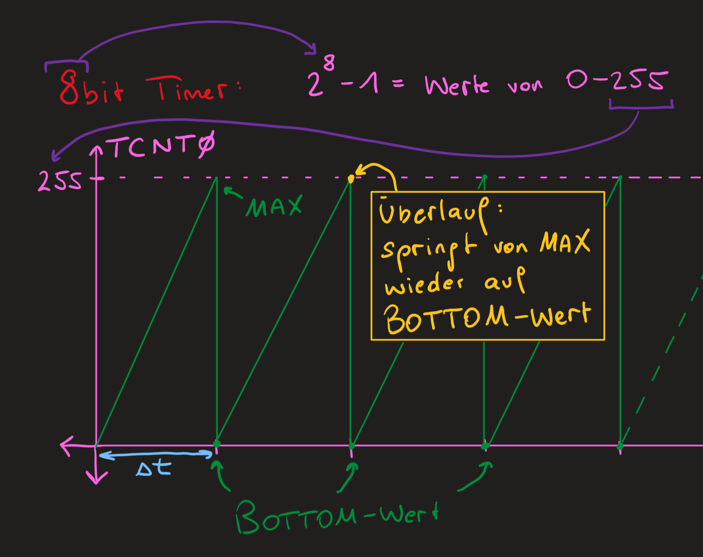

Der Timer ist ein sehr nützliches Instrument in der hardwarenahen Programmierung und eignet sich besonders gut für zeitbasierte Vorgänge, wie zum Beispiel:

-   Delay (Programmverzögerung) um bestimmte Anzahl an Sekunden
-   regelmäßig ADC triggern
-   DC-Motor drehzahlgesteuert zu betreiben

## Theorie

Der ATmega 328p hat 3 verschiedene Timer:

-   TC0: 8-bit
-   TC1: 16-bit
-   TC2: 8-bit; async

Jeder Timer verfügt über ein eigenes Zählregister, welches einmal pro Systemtakt hochzählt. Der 16-bit Timer verfügt hierbei über 2 Bytes, weshalb er seltener überläuft.

### Berechnung von $\Delta t$

#### 8-bit Timer

Um sich die Zeitspanne $\Delta t$ nun auszurechnen benötigen wir den Systemtakt. Dieser ist beim Atmega 328p 16MHz. Daraus ergibt sich folgende Berechnung:

$$
T = \frac {1} {f} = \frac {1} {16MHz} = 0.0000625 ms
$$

Das bedeutet bei einem 8-bit Timer:

$$
\Delta t = T * 2^8 = 0.016 ms
$$

und bei einem 16-bit Timer:

$$
\Delta t = T * 2^16 = 4.096 ms
$$

## Aufbau

## Code
