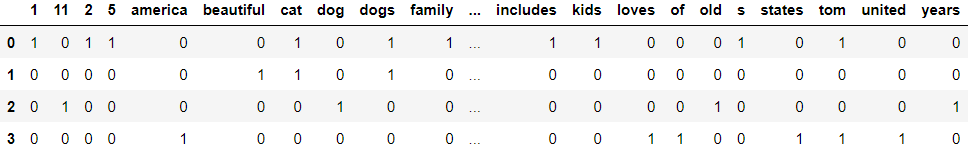

Python ist eine weit verbreitete, benutzerfreundliche Programmiersprache, entwickelt von Guido van Rossum. Mit klarer Syntax und hoher Lesbarkeit ist sie für Anfänger und erfahrene Entwickler gleichermaßen attraktiv. Python wird in Webentwicklung, Datenanalyse, künstlicher Intelligenz und anderen Bereichen eingesetzt. Die Sprache zeichnet sich durch Einfachheit und Flexibilität aus. Ein charakteristisches Merkmal ist, dass Python eine interpretierte Sprache ist, was bedeutet, dass ein Interpreter verwendet wird, um den Code direkt auszuführen, ohne ihn vorher zu kompilieren. Mit einer umfangreichen Standardbibliothek und einer aktiven Entwicklergemeinschaft bietet Python eine robuste Plattform für verschiedene Projekte.

## Grundlegende Syntax

### Variablen

In Python können verschiedene Datentypen für die Speicherung von Informationen verwendet werden.

```python
# Booleans repräsentieren Wahrheitswerte, die entweder True (wahr) oder False (falsch) sind.
im_cool = True  # oder False

# Strings sind Zeichenketten, die Text repräsentieren.
name = "trueberryless"

# Integers sind ganze Zahlen ohne Dezimalstellen.
age = 38

# Floats sind Zahlen mit Dezimalstellen.
book_price = 15.80

# Listen sind geordnete Sammlungen von Elementen.
numbers = [1, 2, 3, 4, 5]
numbers.append(6)
print(numbers[2])  # Gibt das dritte Element der Liste aus, in diesem Fall 3.

# Dictionaries sind Sammlungen von Schlüssel-Wert-Paaren.
person = {
    "name": name,  # Der Schlüssel "name" hat den Wert "trueberryless".
    "age": age  # Der Schlüssel "age" hat den Wert 38.
}
person["favourite_numbers"] = numbers
print(person["name"])  # Gibt den Wert des Schlüssels "name" im Dictionary aus.
```

### Ablaufsteuerung

Die Ablaufsteuerung ermöglicht die Kontrolle über den Programmfluss.

```python
# Die if-Anweisung ermöglicht die Ausführung von Code basierend auf einer Bedingung.
if False:
    print("Never gonna give you up")

# Die elif-Anweisung ermöglicht das Überprüfen weiterer Bedingungen.
if 1 > 2:
    print("1 is greater than 2")
elif 2 > 1:
    print("1 is not greater than 2")
else:
    print("1 is equal to 2")

# Die for-Schleife wird verwendet, um über eine Sequenz von Elementen zu iterieren.
for i in range(1, 100):
    print(i)

# Die for-Schleife kann auch über Elemente einer Liste iterieren.
for number in numbers:
    print(number)

# Die for-Schleife kann auch über Schlüssel-Wert-Paare eines Dictionaries iterieren.
for key, value in person.items():
    print("My %s is %s" % (key, value))  # Gibt formatierten Text aus.

# Die while-Schleife wird wiederholt, solange eine Bedingung wahr ist.
while age < 66:
    print("You are still young")
    age += 1
```

### Klassen

Klassen ermöglichen die Definition von benutzerdefinierten Datentypen (Eigenschaften realer Objekte) und Methoden (Verhalten realer Objekte).

```python
# Eine grundlegende Klasse "Vehicle" mit einem Konstruktor und Getter/Setter-Methoden.
class Vehicle:
    def __init__(self, number_of_wheels, maximum_velocity):
        self.number_of_wheels = number_of_wheels
        self.maximum_velocity = maximum_velocity

    @property
    def number_of_wheels(self):
        return self.number_of_wheels

    @number_of_wheels.setter
    def number_of_wheels(self, number):
        self.number_of_wheels = number

# Die Klasse "Car" erbt von "Vehicle" und ruft den Konstruktor der Elternklasse auf.
class Car(Vehicle):
    def __init__(self, number_of_wheels, maximum_velocity):
        super().__init__(number_of_wheels, maximum_velocity)

# Die Klasse "SpaceShip" erbt ebenfalls von "Vehicle" und hat keine eigenen Änderungen.
class SpaceShip(Vehicle):
    pass

# Ein Objekt der Klasse "Car" wird erstellt.
tesla_model_s = Car(4, 300)
```

## Natural Language Processing

Natürliche Sprachverarbeitung (Natural Language Processing, NLP) ist ein interdisziplinäres Forschungsfeld, das sich mit der Wechselwirkung zwischen Computern und menschlicher Sprache befasst. Das Hauptziel von NLP ist es, Computern die Fähigkeit zu verleihen, menschliche Sprache in all ihren Nuancen zu verstehen, zu interpretieren und darauf zu reagieren. Dies beinhaltet nicht nur die Erkennung von Wörtern und Grammatik, sondern auch die Analyse von Bedeutung, Kontext und sogar Emotionen, die in der menschlichen Sprache enthalten sein können.

NLP nutzt Methoden aus verschiedenen Bereichen wie Linguistik, Informatik und künstliche Intelligenz, um Modelle und Algorithmen zu entwickeln, die es Computern ermöglichen, natürliche Sprache effektiv zu verarbeiten. Zu den grundlegenden Aufgaben von NLP gehören die Textklassifikation, Named Entity Recognition (NER), maschinelles Übersetzen, Textgenerierung und Sentimentanalyse.

### Text Processing

Im ersten Schritt der Natural Language Processing muss der Text so bearbeitet werden, dass Merkmale (Wörter, Features) des Textes von der Maschine besser verarbeitet werden können.

1. **Reinigung**
   Der erste Schritt in der Textverarbeitungspipeline beinhaltet die Reinigung des Texts, um unnötige Zeichen, Symbole oder Formatierungen zu entfernen. Dies erleichtert die folgenden Verarbeitungsschritte und verbessert die Konsistenz der Daten.

2. **Normalisierung**
   Normalisierung beinhaltet die Umwandlung von Text in eine einheitliche Form, z.B. die Umwandlung von Groß- und Kleinschreibung oder die Entfernung von Akzenten. Dies stellt sicher, dass der Text konsistent und vergleichbar ist.

3. **Tokenisierung**
   Tokenisierung teilt den Text in einzelne Wörter oder Token auf. Jedes Token repräsentiert eine bedeutungsvolle Einheit, was die spätere Analyse erleichtert.

4. **Stoppwörter entfernen**
   Stoppwörter wie "und", "oder" oder "das" tragen oft wenig zur Bedeutung bei und werden entfernt, um den Fokus auf relevantere Inhalte zu legen.

5. **Part of Speech Tagging (POS)**
   In diesem Schritt werden den einzelnen Wörtern grammatische Kategorien zugeordnet, wie Substantive, Verben oder Adjektive. Dies hilft bei der Analyse der syntaktischen Struktur.

6. **Named Entity Recognition (NER)**
   Benannte Entitäten wie Personen, Orte oder Organisationen werden identifiziert und markiert, um wichtige Informationen im Text zu extrahieren.

7. **Stemming und Lemmatisierung**
   Der letzte Schritt ist das Stemming (fortgeschrittener: Lemmatisierung (mit Wörterbuch)), bei dem Wörter auf ihren Stamm zurückgeführt werden. Dies hilft, Varianten eines Wortes zu vereinheitlichen und die Analyse zu erleichtern.

#### Normalisierung

Als Normalisierung bezeichnet man die Konvertierung von Text in Kleinbuchstaben. Dies ist in den meisten Fällen der Textverarbeitung sinnvoll, muss jedoch nicht unbedingt geschehen. Außerdem kann auch die Entfernung der Satzzeichen unter der Normalisierung erfolgen.

```python
# Konvertierung in Kleinbuchstaben
df = pd.DataFrame({'tweets': [col.lower() for col in ['I am a dog', 'I am a cat', 'I am a fish']]}).

# Entfernung der Satzzeichen
import re
df.tweets = [re.sub("[^a-z0-9 .]", '', col) for col in df.tweets]
```

#### Tokenisierung

Als Tokenisierung bezeichnet man die Aufteilung eines Textes in einzelne Wörter. Diese Wörter werden als Tokens bezeichnet.

```python
import spacy
nlp = spacy.load("de_core_news_sm") # en_core_web_sm
doc = nlp("Steve Jobs, CEO von Apple, erwägt den Kauf eines österreichischen Startups um 6 Mio. Euro.")

for token in doc:
    print(f"{token.text:{20}}", f"{token.pos_:{10}}", f"{token.ent_type_:{10}}", f"{str(token.is_stop):{10}}", f"{token.lemma_:{20}}")
```

```python
// token.output
Text                 POS        ENT_TYPE   IS_STOP    Lemma
--------------------------------------------------------------------------
Steve                PROPN      PER        False      Steve
Jobs                 PROPN      PER        False      Jobs
,                    PUNCT                 False      --
CEO                  PROPN                 False      CEO
von                  ADP                   True       von
Apple                PROPN      ORG        False      Apple
,                    PUNCT                 False      --
erwägt               VERB                  False      erwägen
den                  DET                   True       der
Kauf                 NOUN                  False      Kauf
eines                DET                   True       ein
österreichischen     ADJ        MISC       False      österreichisch
Startups             NOUN                  False      Startup
um                   ADP                   True       um
6                    NUM                   False      6
Mio.                 NOUN                  False      Mio.
Euro                 NOUN                  False      Euro
.                    PUNCT                 False      --
```

#### Stoppwörter entfernen

Vieler Wörter jeder Sprache haben eine geringen Einfluss auf die Aussagekraft eines Textes. Diese Wörter werden als Stoppwörter bezeichnet. Im Normalfall können KI-Modelle besser trainiert werden, wenn die Stoppwörter aus dem Text entfernt werden.

```python
import spacy
nlp = spacy.load("en_core_web_sm") # de_core_news_sm

class NLP:
    def __init__(self, text):
        self.text = text

    def remove_stopwords(self):
        doc = nlp(self.text)
        self.text = " ".join([token for token in doc if not token.is_stop])
        return self.text

text = "How to develop a chatbot using Python"
text = NLP(text).remove_stopwords()
print(text) # develop chatbot Python
```

#### Parts of Speech Tagging

Part-of-Speech-Tagging ist eine NLP-Technik, die jedem Wort in einem Text grammatikalische Kategorien zuweist, wie Nomen, Verben oder Adjektive. Diese Markierungen helfen bei der Analyse der Satzstruktur und unterstützen Aufgaben wie Textanalyse und Sentimentanalyse.

```python
import spacy
nlp = spacy.load("de_core_news_sm") # en_core_web_sm
doc = nlp("Ich habe immer Hunger.")

for token in doc:
    print(f"{token.text:{20}}", f"{token.pos_:{10}}")
```

```python
// pos.output
Text                 POS
--------------------------------
Ich                  PRON
habe                 AUX
immer                ADV
Hunger               NOUN
.                    PUNCT
```

#### Named Entity Recognition

NER identifiziert und klassifiziert spezifische Entitäten wie Personen, Orte und Organisationen in einem Text. Diese Informationsextraktion ist entscheidend für Anwendungen wie Entitätenverknüpfung und Wissensgraphenaufbau.

```python
import spacy
nlp = spacy.load("de_core_news_sm") # en_core_web_sm
doc = nlp("Marie Curie besuchte das Louvre-Museum in Paris.")

for token in doc:
    print(f"{token.text:{20}}", f"{token.ent_type_:{10}}")
```

```python
// ner.output
Text                 ENT_TYPE
--------------------------------
Marie                PER
Curie                PER
besuchte
das
Louvre-Museum        LOC
in
Paris                LOC
.
```

#### Stemming & Lemmatisierung

Stemming und Lemmatisierung sind Techniken zur Textnormalisierung in der NLP. Sie reduzieren Wörter auf ihre Basisformen (Stammwörter), was die Effizienz von Such- und Klassifikationsalgorithmen verbessert. Lemmatisierung hat hierbei den Vorteil gegenüber Stemming, ein Wörterbuch zu verwenden, das die Wortformen auf ihre Stammebene normalisiert.

```python
import spacy
nlp = spacy.load("de_core_news_sm") # en_core_web_sm
doc = nlp("Michael Jordan erwägt den Kauf eines Autos.")

for token in doc:
    print(f"{token.text:{20}}", f"{token.lemma_:{20}}")
```

```python
// lemma.output
Text                 Lemma
------------------------------------------
Michael              Michael
Jordan               Jordan
erwägt               erwägen
den                  der
Kauf                 Kauf
eines                ein
Autos                Auto
.                    --
```

### Feature Engineering

Machine Learning Algorithmen können mit Text nicht viel anfangen. Diese bevorzugen numerische Eingaben. Besteht nun die Notwendigkeit, Text zu verarbeiten, ist dessen Umwandlung in eine numerische Darstellungsform unumgänglich. Dieser Vorgang ist Teil des sogenannten `Feature Engineerings`. Unter Feature Engineering bei Texten versteht man den Prozess der Auswahl, Erstellung und Transformation von Merkmalen (Features).

Methoden zur Umwandlung von Text in numerische Darstellungen sind beispielsweise `One-Hot Encoding`, `N-Gramme` und `TF-IDF` (Term Frequency-Inverse Document Frequency). N-Gramme werden oft in leichtgewichtigen Shallow-Learning-Modellen wie Random Forest und logistischer Regression verwendet. TF-IDF hingegen finden eher Anwendung in Deep Learning Modellen.

#### One-Hot Encoding

One-Hot Encoding ist eine Methode, bei der jedes Wort in einem Text in eine binäre Vektorform umgewandelt wird. Jedes Wort wird durch eine Spalte repräsentiert, und wenn das Wort im Text vorkommt, wird die entsprechende Spalte auf 1 gesetzt, sonst auf 0.

```python
import spacy
from sklearn.feature_extraction.text import CountVectorizer
nlp = spacy.load('en_core_web_sm') # de_core_news_sm

text="Jim loves NLP. He will learn NLP in two monts. NLP is Jim's future."

def get_spacy_tokens(text):
    doc = nlp(text)
    return [token.text for token in doc]
text_tokens = get_spacy_tokens(text)
vectorizer = CountVectorizer(tokenizer=get_spacy_tokens, lowercase=False, token_pattern=None)

vectorizer.fit(text_tokens)
print("Vocabulary:\n", vectorizer.vocabulary_)

vector = vectorizer.transform(text_tokens)
print("Encoded Document is:\n", vector.toarray())
```

```python
// one-hot.output
Vocabulary:
 {'Jim': 3, 'loves': 9, 'NLP': 4, '.': 1, 'He': 2, 'will': 12, 'learn': 8, 'in': 6, 'two': 11, 'monts': 10, 'is': 7, "'s": 0, 'future': 5}
Encoded Document is:
 [[0 0 0 1 0 0 0 0 0 0 0 0 0]
 [0 0 0 0 0 0 0 0 0 1 0 0 0]
 [0 0 0 0 1 0 0 0 0 0 0 0 0]
 [0 1 0 0 0 0 0 0 0 0 0 0 0]
 [0 0 1 0 0 0 0 0 0 0 0 0 0]
 [0 0 0 0 0 0 0 0 0 0 0 0 1]
 [0 0 0 0 0 0 0 0 1 0 0 0 0]
 [0 0 0 0 1 0 0 0 0 0 0 0 0]
 [0 0 0 0 0 0 1 0 0 0 0 0 0]
 [0 0 0 0 0 0 0 0 0 0 0 1 0]
 [0 0 0 0 0 0 0 0 0 0 1 0 0]
 [0 1 0 0 0 0 0 0 0 0 0 0 0]
 [0 0 0 0 1 0 0 0 0 0 0 0 0]
 [0 0 0 0 0 0 0 1 0 0 0 0 0]
 [0 0 0 1 0 0 0 0 0 0 0 0 0]
 [1 0 0 0 0 0 0 0 0 0 0 0 0]
 [0 0 0 0 0 1 0 0 0 0 0 0 0]
 [0 1 0 0 0 0 0 0 0 0 0 0 0]]
```

##### mit Pandas

Mittels der verwirrend benannten Methode `get_dummies()` kann man One-Hot Encoding auch mit Pandas durchführen.

```txt
// products.csv
produkt_id,kategorie
1,Elektronik
2,Kleidung
3,Bücher
4,Elektronik
5,Elektronik
6,Bücher
7,Kleidung
8,Bücher
9,Elektronik
10,Kleidung
11,Bücher
12,Elektronik
13,Bücher
14,Elektronik
15,Kleidung
16,Kleidung
```

```python
import pandas as pd
df = pd.read_csv('products.csv')
df = pd.get_dummies(df, columns=["kategorie"], dtype=int)
df.columns = map(str.lower, df.columns)
print(df)
```

```python
// one-hot_pandas.output
    produkt_id  kategorie_bücher  kategorie_elektronik  kategorie_kleidung
0            1                 0                     1                   0
1            2                 0                     0                   1
2            3                 1                     0                   0
3            4                 0                     1                   0
4            5                 0                     1                   0
5            6                 1                     0                   0
6            7                 0                     0                   1
7            8                 1                     0                   0
8            9                 0                     1                   0
9           10                 0                     0                   1
10          11                 1                     0                   0
11          12                 0                     1                   0
12          13                 1                     0                   0
13          14                 0                     1                   0
14          15                 0                     0                   1
15          16                 0                     0                   1
```

#### Count Vectorizer

Mithilfe des `CountVectorizer` kann man ein Vokabular erstellen und die Wörter in einem Text in numerische Vektoren umwandeln.

```python
from sklearn.feature_extraction.text import CountVectorizer
```

```python
text = ["Tom's family includes 5 kids 2 dogs and 1 cat",
        "The dogs are friendly. The cat is beautiful",
        "The dog is 11 years old",
        "Tom loves in the United States of America"]
```

Standardmäßig kann der `CountVectorizer` so verwendet werden:

```python
vectorizer = CountVectorizer()
vectorizer.fit(text)
print(vectorizer.get_feature_names_out())
# ['11' 'america' 'and' 'are' 'beautiful' 'cat' 'dog' 'dogs' 'family' 'friendly' 'in' 'includes' 'is' 'kids' 'loves' 'of' 'old' states' 'the' 'tom' 'united' 'years']
```

Dabei werden einbuchstabige Wörter wie `a`, `I` oder Zahlen ignoriert, was mittels `token_pattern` geändert werden kann.

```python
vectorizer = CountVectorizer(token_pattern=u'(?u)\\b\\w+\\b')
vectorizer.fit(text)
print(vectorizer.get_feature_names_out())
# ['1' '11' '2' '5' 'america' 'and' 'are' 'beautiful' 'cat' 'dog' 'dogs' 'family' 'friendly' 'in' 'includes' 'is' 'kids' 'loves' 'of' 'old' 's' 'states' 'the' 'tom' 'united' 'years']
```

Wenn gewisse Wörter gefiltert werden sollen, kann man dies mit `stop_words` tun.

```python
vectorizer = CountVectorizer(token_pattern=u'(?u)\\b\\w+\\b',
                             stop_words=['is','are','and','in','the'])
vectorizer.fit(text)
print(vectorizer.get_feature_names_out())
# ['1' '11' '2' '5' 'america' 'beautiful' 'cat' 'dog' 'dogs' 'family' 'friendly' 'includes' 'kids' 'loves' 'of' 'old' 's' 'states' 'tom' 'united' 'years']
```

Jedes Vokabel enthält hier nur ein Wort, was bedeutet, dass beispielsweise `unite states of america` nicht gefunden werden kann. Will man dieses Verhalten beeinflussen, kann man mittels `ngram_range` die minimale und maximale Wortanzahl festlegen.

```python
vectorizer = CountVectorizer(token_pattern=u'(?u)\\b\\w+\\b',
                             stop_words=['is','are','and','in','the'],
                             ngram_range=(1,4))
vectorizer.fit(text)
print(vectorizer.get_feature_names_out())
# ['1' '1 cat' '11' '11 years' '11 years old' '2' '2 dogs' '2 dogs 1' '2 dogs 1 cat' '5' '5 kids' '5 kids 2' '5 kids 2 dogs' 'america' 'beautiful' 'cat' 'cat beautiful' 'dog' 'dog 11' 'dog 11 years' 'dog 11 years old' 'dogs' 'dogs 1' 'dogs 1 cat' 'dogs friendly' 'dogs friendly cat' 'dogs friendly cat beautiful' 'family' 'family includes' 'family includes 5' 'family includes 5 kids' 'friendly' 'friendly cat' 'friendly cat beautiful' 'includes' 'includes 5' 'includes 5 kids' 'includes 5 kids 2' 'kids' 'kids 2' 'kids 2 dogs' 'kids 2 dogs 1' 'loves' 'loves united' 'loves united states' 'loves united states of' 'of' 'of america' 'old' 's' 's family' 's family includes' 's family includes 5' 'states' 'states of' 'states of america' 'tom' 'tom loves' 'tom loves united' 'tom loves united states' 'tom s' 'tom s family' 'tom s family includes' 'united' 'united states' 'united states of' 'united states of america' 'years' 'years old']
```

Will man das Vokabular auf bestimmte Vokabeln begrenzen, kann man dies mit `vocabulary` tun.

```python
vectorizer = CountVectorizer(token_pattern=u'(?u)\\b\\w+\\b',
                             stop_words=['is','are','and','in','the'],
                             ngram_range=(1,4),
                             vocabulary=['united states of america'])
vectorizer.fit(text)
print(vectorizer.get_feature_names_out())
# ['united states of america']
```

Sobald man mit den Features zufrieden ist, kann man sich das Vokabular anzeigen lassen. Dieses ist ein Dictionary, welches jedes Wort einer Zahl zuweist, damit beim Machine Learning Prozess besser damit gearbeitet werden kann. Computer verstehen Nummern besser als Wörter.

```python
print(vectorizer.vocabulary_)
# {'tom': 18, 's': 16, 'family': 9, 'includes': 11, '5': 3, 'kids': 12, '2': 2, 'dogs': 8, '1': 0, 'cat': 6, 'friendly': 10, 'beautiful': 5, 'dog': 7, '11': 1, 'years': 20, 'old': 15, 'loves': 13, 'united': 19, 'states': 17, 'of': 14, 'america': 4}
```

Nun kann man die Features mittels `.transform()` in einem Nummern-Matrix umwandeln. Diese sagt aus, welche Vokabeln in den vier Sätzen von `text` vorkommen. Beispielsweise kommt im ersten Satz das Wort `Tom` vor, weswegen an Index 18 die Zahl 1 steht (grün markiert).

```python ins="‎1"
vector = vectorizer.transform(text)
print(vector.shape) # (4, 21)
print(vector.toarray())
# [
# [1 0 1 1 0 0 1 0 1 1 0 1 1 0 0 0 1 0 ‎1 0 0]
# [0 0 0 0 0 1 1 0 1 0 1 0 0 0 0 0 0 0 0 0 0]
# [0 1 0 0 0 0 0 1 0 0 0 0 0 0 0 1 0 0 0 0 1]
# [0 0 0 0 1 0 0 0 0 0 0 0 0 1 1 0 0 1 1 1 0]
# ]
```

:::tip[Aha]
Falls Sie sich fragen, woher die Zahl `21` bei der Shape kommt: Es gibt 21 unterschiedliche Wörter in den Sätzen von `text`. Zumindest hat der CountVectorizer die Sätze so tokenisiert.
:::

Mit dem `CountVectorizer` kann man auch die Features in einem Pandas DataFrame anzeigen lassen.

```python
import pandas as pd
pd.DataFrame(vector.toarray(), columns=vectorizer.get_feature_names_out())
```



#### Bag-of-words (BOW)

### Modeling
