Marketing stellt den **Kunden in den Mittelpunkt.** Es sollen **Kundenzufriedenheit und Kundenbindung** erreicht werden.

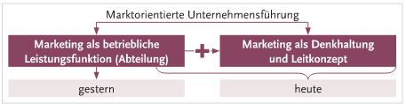

## Marketingkonzeption (Marketingkonzept)

-   Festlegen der angestrebten Ziele
-   Strategien für die Realisierung wählen
-   Adäquate Marketinginstrumente auswählen

Um Marketing besser einsetzten zu können, betreibt man **Marktforschung.**

## Ziele des Marketings

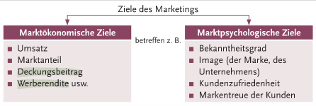

## Marketingstrategien

Marketingstrategien legen die langfristig notwendigen Maßnahmen fest, um sicherzustellen, dass alle Instrumente zielführend eingesetzt werden.

### Marktsegmentierungsstrategien: Zerlegung des Markts in Teilmärkte

Man kann meistens nicht alle Zielgruppen auf einmal ansprechen. Deshalb sollte man herausfinden, wer der Abnehmer für sein Produkt ist. **Das beste und kreativste Marketingkonzept verfehlt seine Absicht, wenn die Zielgruppe nicht erreicht wird!**

Das **Zielgruppenorientierte Marketing** erfolgt folgendermaßen:

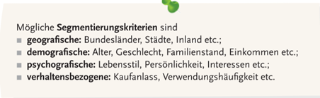

#### Marktsegmentierung

Aufteilen des Marktes in Käufergruppen ermöglicht es, Marketinginstrumente den Kundenwünschen und -erwartungen anzupassen.

#### Festlegung des Zielmarktes

Unternehmen müssen entscheiden, ob es Teilmärkte oder den Gesamtmarkt bedienen will:

-   Ein oder mehrere Segmente
    -   **Konzentriertes Marketing**
    -   Es wird ein oder mehrere Teilmärkte mit **maßgeschneiderten Marketing** bearbeitet
-   Gesamtmarkt (alle Segmente)
    -   Entweder:
        -   **Differenziertes Marketing** -\> (pro Zielgruppe)
        -   **Undifferenziertes Marketing** -\> (ohne Unterscheidung der Zielgruppen)

#### Marktpositionierung

Es wird ein **bedeutsamer Kundennutzen** angesprochen, um von den Leistung zu überzeugen. Man will sich dauerhaft **positiv** von der Konkurrenz abgrenzen um eine **„Unique Selling Proposition" (USP)** zu erhalten.

## Umsetzung der Marketingstrategien durch Marketinginstrumente

**Marketinginstrumente** sind bestimmte Maßnahmen und Mittel, um Aktivitäten am Markt gezielt zu gestalten. Es wird hierbei in 4 verschiedene Unterschieden. Die beste Wirkung wird erzielt, wenn man sie zusammeneinsetzt und aufeinander abstimmt -\> **Marketingmix.** Um diesen Mix zu planen, greift man auf die **Marktforschung** zurück.

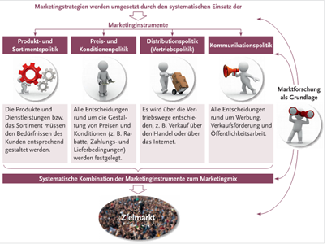

### Marktforschung

Die Marktforschung soll helfen, den Markt besser kennenzulernen und Instrumente besser einzusetzen.

Unter Marktforschung versteht man die systematische

-   Sammlung
-   Aufbereitung
-   Analyse
-   Interpretation

von Informationen über Märkte mittels geeigneter **Methoden und Techniken.**

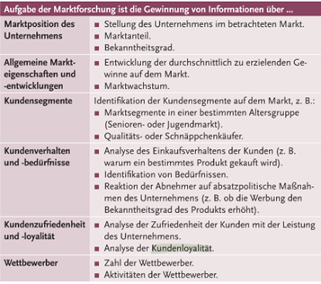

### Marktforschungsmethoden

#### Sekundärforschung

Hier werden bereits vorhandene Daten ausgewertet.

-   **Unternehmerische Informationsquellen**
    -   Außendienstberichte
    -   Kundenstatistiken
    -   Unterlagen aus der Buchhaltung
    -   Umsatzstatistiken
    -   Frühere Marktforschungsuntersuchungen
-   **Unternehmensexterne Informationsquellen**
    -   Internet
    -   Amtliche Statistiken
    -   Externe Datenbanken
    -   Publikationen
    -   Veröffentlichungen anderer Unternehmen oder Institutionen

Ist es nicht möglich das Problem so zu lösen, ist die primäre Marktforschung durchzuführen

#### Primärforschung

Wenn man auf dem Markt erstmals Daten für einen bestimmten Zweck erhebt, spricht man on **primärer Marktforschung.**

**Wichtigste Datenerhebungsmethoden:**

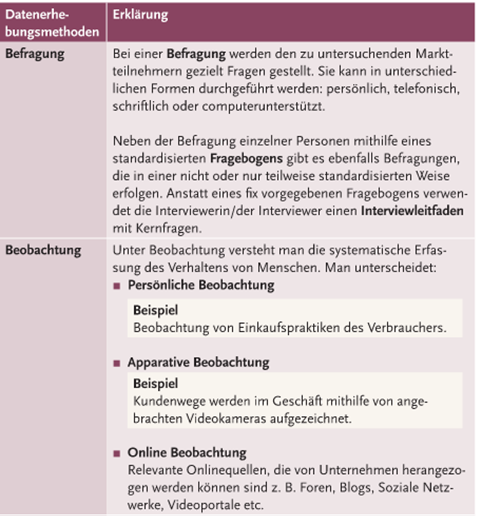
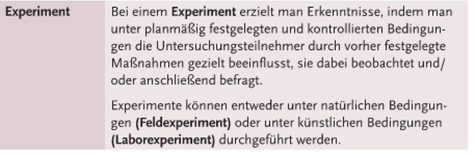
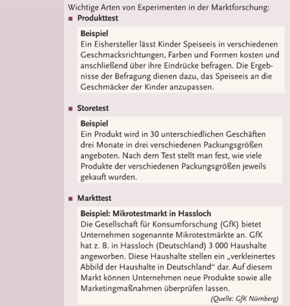

## Instrumente des Marketings

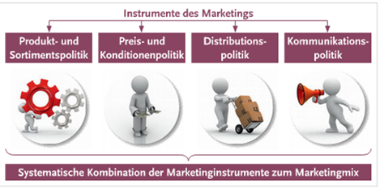

### Produkt- und Sortimentspolitik

Die Produkt- und Sortimentspolitik umfasst alle planmäßig aufeinander abgestimmten unternehmerischen Entscheidungen und Maßnahmen, um die Produkte eines Unternehmens kundengerecht auf dem Markt anzubieten.

Unter einem Produkt versteht man:

-   Sachgüter
-   Dienstleistungen
-   Personen
-   Orte
-   Organisationen

Alle Produkte eines Unternehmens gemeinsam bezeichnet man als **Produktprogramm bzw. Sortiment**.

### Kunden- und marktgerechte Gestaltung von Produkten

Produkte sollten den Bedürfnissen und Erwartungen des Kunden entsprechen oder sie sogar übertreffen, um Begeisterung hervorzurufen.

#### Nutzen eines Produktes

-   Grundnutzen
    -   Was der Kunde Grundsätzlich vom Produkt erwartet
-   Zusatznutzen
    -   Alles, was die Grundnutzen übertrifft -\> z. B. zusätzliche Funktionen
-   Zusatzleistungen
    -   Zusätzliche Leistungen zu einem Produkt, meistens in form von Dienstleistungen

Mit solchen Zusatzleistungen / Zusatznutzen kann man sich gut von Wettbewerbern **abheben** :

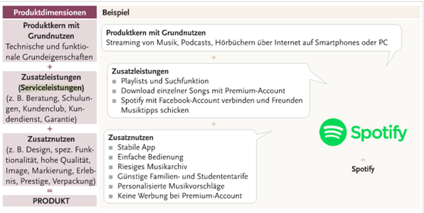

### Produktanalyse

Analyse, ob und wie ein Produkt in Zukunft erfolgreich sein wird. Wichtige Hilfsmittel:

-   Produktzyklusanalyse
-   Portfolioanalyse

#### Produktlebenszyklus

Das **Produktlebenszyklusmodell** geht davon aus, dass Produkte grundsätzlich wie Lebewesen einem Lebenszyklus unterworfen sind.

Die Lebensdauer von Produkten ist begrenzt durch:

-   Technischen Fortschritt
-   Änderungen des Verbraucherverhaltens
-   Kurzlebige Trends

Der Lebenszyklus kann auf **einzelne Produkte** , **Produktgruppen** oder auch **Produktbranchen** bezogen werden.

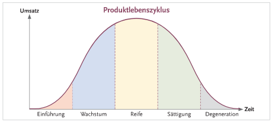

Man unterscheidet in folgende Phasen:

-   Einführungsphase
    -   Das Produkt wird am Markt eingeführt -\> bringt wenig Umsatz
-   Wachstumsphase
    -   Der Umsatz steigt kontinuierlich, das Produkt kommt gut an -\> Werbemaßnahmen zur Unterstützung
-   Reifephase
    -   Umsatzzuwächse lassen nach
-   Sättigungsphase
    -   Der Markt wird gesättigt -\> Umsatzsteigung nicht mehr möglich -\> Umsatz geht zurück
-   Degenerationsphase
    -   Der Umsatz sinkt immer mehr -\> Produkt relaunchen oder vom Markt nehmen
-   Elimination

#### Portfolioanalyse

Die Portfolioanalyse ordnet die Produkte in eine 4-Feld-Matrix mit den Koordinatenachsen „ **Marktwachstum**" und „relativer „ **Marktanteil**" (relativ zum größten Konkurrenten)

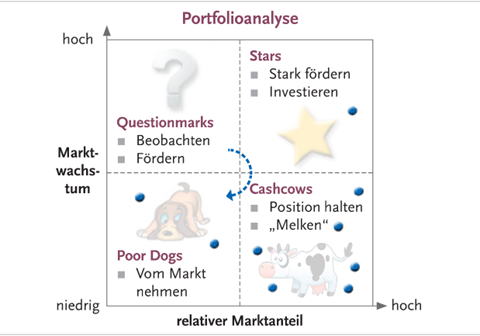

Unterteilung in vier Felder:

-   Questionmarks
    -   Nachwuchsprodukte in der Einführungsphase
    -   Geringer Marktanteil -\> befinden sich aber auf einem wachstumsmarkt
    -   Hohe finanzielle Förderung
-   Stars
    -   Hohe Wachstumsraten
    -   Teilweise hohe gewinne
    -   Umsatz und Marktanteil kann noch gesteigert werden
-   Cashcows
    -   Braucht kaum mehr Investition
    -   Viel Gewinn
    -   Versuchen möglichst lange zu halten
-   Poor Dogs
    -   Sollten aufgrund von schlechter Zukunftsperspektive vom Markt genommen werden
