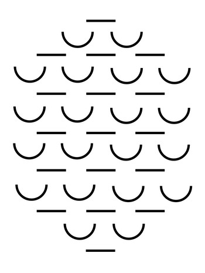

In der Epoche Expressionismus äußern die Künstler starke Kritik an einigen Themen, wie zum Beispiel Großstadt, Massengesellschaft, Industrialisierung, Militarisierung, Manipulation und dem Ersten Weltkrieg. Diese Epoche ist eine Opposition vom Realismus und Naturalismus, welche nur die Realität abgebildet haben. Außerdem wendet man sich von Fin de Siècle (Flucht in Ästhetik) und Goethe ab.

> _[...] Weg überhaupt mit den sogenannten Dichtern! Schluss! Unsere Kultur ist Gerümpel. [...] Der junge Dichter muss demolieren. [...]_

Vorbilder des Expressionismus sind Sturm und Drang, Barock, die Kunst der Kinder und Naturvölker sowie literarische Außenseiter (Hölderlin, Kleist, Büchner und E.T.A. Hoffmann). Viele Autoren und Künstler allgemein bezeichnen sich als Aktivisten, Sturmkünstler und Abstrakte.

## Eckdaten

-   Beginn 20. Jahrhundert
-   Sprachzertrümmerung
-   nicht interpretierbare Gedichte

## Expressionismus und Co.

Der Begriff Expressionismus kommt ursprünglich aus der bildenden Kunst, wie sie Egon Schiele oder Oskar Kokoschka ausführen. Die Bilder sollen ausdrücken, wie der Künstler die Welt erlebt.

Der Begriff Dadaismus ist in der Epoche des Expressionismus entstanden und beschreibt eine Zerstörung der Sprache. Er umfasst Gedichte, welche nicht interpretierbar sind und keinen Sinn haben.

## Künstler

Als Grundlage dieser Epoche dienen [Friedrich Nietzsche](../impressionism#friedrich-nietzsche-1844-1900)s [Also sprach Zarathustra](../impressionism/#also-sprach-zarathustra-1883) und Sören Kierkegaards „Freiheit ist zentral“, welcher die Freiheit in den Mittelpunkt des Denken stellt. Im Gegensatz zum Tier kann der Mensch sich für eine bestimmte Lebensweise entscheiden. Er kann in einem oberflächlichen Genussleben verharren, der von Kierkegaard so genannten „ästhetischen“ Existenz. Er kann aber auch in einer „ethischen“ Existenz solidarisch am Aufbau einer humanen Gesellschaft mitarbeiten.

Auch die Expressionisten stellen dem oberflächlichen alten einen kommenden neuen Menschen gegenüber, der sich vom alten grundlegend unterscheidet und gegenüber den Mitmenschen solidarisch ist. Der „alte“ Mensch ist dabei herzensträge, hart, böse, den Mitmenschen fremd und getrennt durch Grenzpfähle. Außerdem werden die Begriffe **Gesellschaft** und **Gemeinschaft** gegenübergestellt, wobei ersteres ein Konstrukt mit Regeln definiert, in welchem man seine Mitmenschen nicht kennt, und zweiteres eine harmonischere, kleinere Gruppe von sich einander bewusst kennenden Menschen beschreibt.

### Hermann Bahr (1863-1934)

Hermann Bahr war ein Kritiker mit dem Wunsch der Zerstörung. Er sah den Expressionismus als Epoche der Zerstörung und dachte, Kunst soll dabei helfen.

### August Stramm (1874-1915)

August Stramm war ein deutscher expressionistischer Dichter und Dramatiker. Er starb im Ersten Weltkrieg. Bekannt für innovative Sprache und experimentellen Stil, hinterließ er Gedichtsammlungen wie „Tropfblut“ und „Menschheitsdämmerung“. Stramms radikale Herangehensweise an Literatur beeinflusste den Expressionismus maßgeblich. Einige seiner bekannten Werke sind [„Zwist“ (1914)](#zwist-1914) und [„Patrouille“ (1915)](#patrouille-1915).

### Franz Kafka (1883-1924)

Franz Kafka war ein einflussreicher deutschsprachiger Schriftsteller des 20. Jahrhunderts. Bekannt für seine einzigartige literarische Welt, schuf er Werke wie [„Die Verwandlung“ (1915)](#die-verwandlung-1915), in dem der Protagonist zu einem Käfer wird, und [„Der Prozess“ (1914)](#der-prozess-1914), der die Absurditäten eines undurchsichtigen Gerichtssystems thematisiert. In seinem [„Brief an den Vater“ (1919)](#brief-an-den-vater-1919) reflektiert Kafka über seine Beziehung zu seinem autoritären Vater.

Obwohl er zur Zeit des Expressionismus lebte, entzogen sich Kafkas Werke einer einfachen Einordnung in diese Epoche. Seine Werke zeichnen sich durch existenzielle Themen, Isolation und dem Ausbruch aus der Realität aus. In fast jedem seiner Werke geschieht ein Zwischenfall, welcher den Lebensalltag unterbricht.

Kafka verstarb 1924 und hinterließ ein literarisches Erbe von großer Tiefe und Komplexität, das weiterhin Leser weltweit fasziniert. Aufgrund seines einzigartigen Schreibstiles und Inhalts hat Kafka ein eigenes Adjektiv verdient: „kafkaesk“ (_in der Art der Schilderungen Kafkas, auf rätselhafte Weise unheimlich, bedrohlich_).

#### Kafkas Leben

Kafka baut in vielen Werken seinen eigenen Namen mit Ähnlichkeiten zum Hauptcharakter ein. Beispielsweise hat `Samsa` die gleiche Vokalfolge und Buchstabenanzahl wie `Kafka`. Außerdem gibt es Übereinstimmungen zwischen Gregors Wohnung in [der „Verwandlung“](#die-verwandlung-1915) mit Kafkas eigener Wohnung. Dies lässt darauf schließen, dass die Erkenntnis der Chancenlosigkeit Kafkas Personen, welche die eigenen Kräfte übersteigt, persönliche Hintergründe haben. Einige Traumen Kafkas können in dem [Brief an den Vater](#brief-an-den-vater-1919) herausgelesen werden.

### Gottfried Benn (1886-1956)

Gottfried Benn übte starke Kritik am Fortschritt der Militarisierung aus. Er meinte, er sehe keinen Fortschritt, wenn aus der mörderischen Gewehrkugel eine noch mörderische Granate wird. Zu seinen bekanntesten Werken zählt [Kleine Aster](#kleine-aster-1912) und [Schöne Jugend](#schöne-jugend-1912).

### Georg Heym (1887-1912)

Georg Heym war ein deutscher Dichter und Schriftsteller des Expressionismus. Geboren in Hirschberg, studierte er Jura, Kunstgeschichte und Philosophie in Berlin. Dort schloss er sich der expressionistischen Künstler- und Schriftstellerbewegung an.

Heyms literarisches Schaffen zeichnet sich durch eine düstere, oft apokalyptische Atmosphäre aus. Bekannte Werke sind die Gedichtsammlungen „Der ewige Tag“ (1911) und [„Der Gott der Stadt“ (1910)](#der-gott-der-stadt-1910), letzteres wollte er lange nicht veröffentlichen, obwohl wenig Kritik geäußert wurde. Sein Schreibstil reflektiert die Unruhe und Unzufriedenheit der Zeit vor dem Ersten Weltkrieg.

Der Dichter fand tragischerweise früh seinen Tod im Alter von nur 24 Jahren durch Ertrinken in der Havel. Trotz seiner kurzen Lebensspanne hinterließ Georg Heym einen bleibenden Einfluss auf die deutsche expressionistische Literatur.

### Jakob van Hoddis (1887-1942)

Jakob van Hoddis war ein deutscher Dichter des Expressionismus. Geboren als Hans Davidsohn in Berlin, änderte er seinen Namen später in Jakob van Hoddis. Sein Leben war geprägt von psychischer Instabilität, und er verbrachte einige Zeit in psychiatrischen Einrichtungen.

Van Hoddis war ein Mitglied der expressionistischen Bewegung und ein Teil der Dichtergruppe „Der Neue Club“. Sein bekanntestes Werk ist das Gedicht [„Weltende“ (1911)](#weltende-1911), das als eines der bedeutendsten expressionistischen Gedichte gilt. Dieses Werk spiegelt die Unruhe und Verunsicherung der Zeit vor dem Ersten Weltkrieg wider.

Jakob van Hoddis' literarische Karriere war kurz, und er geriet nach dem Ausbruch des Ersten Weltkriegs in Vergessenheit. Er wurde Opfer des nationalsozialistischen Regimes und starb 1942 in einer Anstalt in Brandenburg an der Havel.

Trotz seiner kurzen Schaffenszeit hatte van Hoddis einen nachhaltigen Einfluss auf die expressionistische Dichtung und wird als wichtiger Vertreter dieser literarischen Strömung betrachtet.

### Alfred Lichtenstein (1889-1914)

Alfred Lichtenstein war ein deutscher expressionistischer Dichter. Geboren in Berlin, wurde er bekannt für seine sarkastischen und sozialkritischen Gedichte. Lichtenstein war Teil der literarischen Bewegung des Expressionismus und gehörte zur Dichtergruppe „Der Neue Club“. Sein Werk spiegelt die Unruhe und Spannungen der Zeit vor dem Ersten Weltkrieg wider. Er fiel im Krieg 1914 im Alter von 25 Jahren. Lichtensteins Gedichte, darunter [„Abschied“ (1914)](#abschied-1914) und „Die Dämmerung“, zeigen einen einzigartigen Stil, der von einer düsteren Weltsicht und einer ausgeprägten Sprachkunst geprägt ist.

## Werke

### Der Gott der Stadt (1910)

[Georg Heym](#georg-heym-1887-1912) beschreibt Gott (Baal) in diesem Gedicht mit dunklen Farben, wie zum Beispiel „schwarzen Winden“, „roter Bauch“, „schwarzen Türmen“ und „dunkler Abend“. Gott ist zornig, sauer, düster, rot. Außerdem wird die Stadt mit eher schlechteren Aspekten beschrieben: Fabriken, Abgase, Brand, laut, Industrialisierung, Massengesellschaft, Feuer, Glutqualm.

<blockquote>

Auf einem Häuserblocke sitzt er breit.  
Die Winde lagern schwarz um seine Stirn.  
Er schaut voll Wut, wo fern in Einsamkeit  
Die letzten Häuser in das Land verirrn.

Vom Abend glänzt der rote Bauch dem Baal,  
die großen Städte knien um ihn her.  
Der Kirchenglocken ungeheure Zahl  
Wogt auf zu ihm aus schwarzer Türme Meer.

Wie Korybanten-Tanz dröhnt die Musik  
Der Millionen durch die Straßen laut.  
Der Schlote Rauch, die Wolken der Fabrik  
Ziehn auf zu ihm, wie Duft von Weihrauch blaut.

Das Wetter schwelt in seinen Augenbrauen.  
Der dunkle Abend wird in Nacht betäubt.  
Die Stürme flattern, die wie Geier schauen  
Von seinem Haupthaar, das im Zorne sträubt.

Er streckt ins Dunkel seine Fleischerfaust.  
Er schüttelt sie. Ein Meer von Feuer jagt  
Durch eine Straße. Und der Glutqualm braust  
Und frißt sie auf, bis spät der Morgen tagt.

</blockquote>

### Weltende (1911)

In dem Gedicht Weltende, beschreibt der Sturm eine Zerstörung, da die Wellen zu Tsunamis werden, Häuser einstürzen und die Welt zusammenbricht. Der vorletzte Vers sticht besonders hervor, da es ein vergleichsweise kleines Problem im Gegensatz zum Weltuntergang ist. [Jakob van Hoddis](#jakob-van-hoddis-1887-1942) will damit aussagen, dass dem Menschen alles egal ist, was er nur in der Zeitung liest.

<blockquote>

Dem Bürger fliegt vom spitzen Kopf der Hut,  
In allen Lüften hallt es wie Geschrei,  
Dachdecker stürzen ab und gehn entzwei  
Und an den Küsten – liest man – steigt die Flut.

Der Sturm ist da, die wilden Meere hupfen  
An Land, um dicke Dämme zu zerdrücken.  
Die meisten Menschen haben einen Schnupfen.  
Die Eisenbahnen fallen von den Brücken.

</blockquote>

### Schöne Jugend (1912)

Der Titel mag irreführend sein, da es sich in diesem Gedicht nicht um Menschen, sondern **Ratten** handelt.

<blockquote>

Der Mund eines Mädchens, das lange im Schilf gelegen hatte,  
sah so angeknabbert aus.  
Als man die Brust aufbrach, war die Speiseröhre so löcherig.  
Schließlich in einer Laube unter dem Zwerchfell  
fand man ein Nest von jungen Ratten.  
Ein kleines Schwesterchen lag tot.  
Die andern lebten von Leber und Niere,  
tranken das kalte Blut und hatten  
hier eine schöne Jugend verlebt.  
Und schön und schnell kam auch ihr Tod:  
Man warf sie allesamt ins Wasser.  
Ach, wie die kleinen Schnauzen quietschten!

</blockquote>

### Kleine Aster (1912)

In diesem Gedicht symbolisiert die Aster eine Blume und _keinen_ Vogel, sodass genau wie bei [Schöne Jugend](#schöne-jugend-1912) eine Lesertäuschung vorliegt.

<blockquote>

Ein ersoffener Bierfahrer wurde auf den Tisch gestemmt.  
Irgendeiner hatte ihm eine dunkelhelllila Aster zwischen die Zähne geklemmt.  
Als ich von der Brust aus  
unter der Haut  
mit einem langen Messer  
Zunge und Gaumen herausschnitt,  
Muss ich sie angestoßen haben, denn sie glitt in das nebenliegende Gehirn.  
Ich packte sie ihm in die Brusthöhle zwischen die Holzwolle,  
als man zunähte.  
Trinke dich satt in deiner Vase!  
Ruhe sanft,  
Kleine Aster!

</blockquote>

### Der Prozess (1914)

Eine Geschichte, in welcher Josef K. verhaftet wird, obwohl er nichts falsches getan hat. Während der gesamten Handlung wird eine Schuld von Josef K. nicht erkennbar. Aus diesem Grund endet „Der Prozess“ auch nicht mit einer Verhandlung. So wie am Beginn des Romans zwei Männer in K.s Zimmer auftauchen und ihn aus seinem gewohnten Leben werfen, so tauchen im Schlusskapitel zwei Männer auf, um den „Prozess“ zu beenden. Josef K. weiß, dass es seine Pflicht wäre, sich mit dem Messer selbst umzubringen, jedoch tut er dies nicht. Stattdessen bringen die beiden Männer ihm zu einem an den Steinbruch angrenzenden Haus, wo sie ihn erstechen.

### Zwist (1914)

In dem Gedicht kann man nicht alles deuten, jedoch kann man einige Stilfiguren herauslesen, z. B. Antithesen (Quälen küsst, Kosen schelten, ...). Eine weitere (eventuell erwähnenswerte) Eigenschaft ist die exzessive Verwendung von Verben.

<blockquote>

Gallen foltern bäumen lösen  
Knirschen zürnen meiden Hass  
Verben  
Zittern stampfen schäumen grämen  
Suchen beben forschen bang  
Wenden zagen schauen langen  
Stehen rühren seufzen gehn  
Streicheln klagen  
Kosen schelten  
Schämen schmäht Und  
Fliehen wirbt  
Schmiegen wehret  
Armen sträubet  
Quälen küsst

</blockquote>

### Abschied (1914)

[Alfred Lichtenstein](#alfred-lichtenstein-1889-1914) schrieb kurz vor seinem Tod im Ersten Weltkrieg noch dieses sprachlich exzellente Gedicht.

<blockquote>

Vorm Sterben mache ich noch mein Gedicht.  
Still, Kameraden, stört mich nicht.

Wir ziehn zum Krieg. Der Tod ist unser Kitt.  
Oh; heulte mir doch die Geliebte nit. -

Was liegt an mir. Ich gehe gerne ein.  
Die Mutter weint. Man muß aus Eisen sein.

Die Sonne fällt zum Horizont hinab.  
Bald wirft man mich ins milde Massengrab.

Am Himmel brennt das brave Abendrot.  
Vielleicht bin ich in dreizehn Tagen tot.

</blockquote>

### Die Verwandlung (1915)

Kafkas Erzählungen und Romane setzen oft mit Situationen ein, die für die Betroffenen unerklärlich und bedrohlich sind. Ein durchaus realistischer Sachverhalt sprengt plötzlich die Grenzen der Realität. Es gibt viele Parodien von der Verwandlung, zum Beispiel [Jan Böhmermanns Satire](https://www.youtube.com/watch?v=8F2IXNErOas). „Die Verwandlung“ beginnt mit folgenden Sätzen:

<blockquote>

Als Gregor Samsa eines Morgens aus unruhigen Träumen erwachte, fand er sich in seinem Bett zu einem ungeheueren Ungeziefer verwandelt. Er lag auf seinem panzerartig harten Rücken und sah, wenn er den Kopf ein wenig hob, seinen gewölbten, braunen, von bogenförmigen Versteifungen geteilten Bauch, auf dessen Höhe sich die Bettdecke, zum gänzlichen Niedergleiten bereit, kaum noch erhalten konnte. Seine vielen, im Vergleich zu seinem sonstigen Umfang kläglich dünnen Beine flimmerten ihm hilflos vor den Augen. »Was ist mit mir geschehen?« dachte er. Es war kein Traum.

</blockquote>

Der Stück ist in drei Teile geteilt, wobei der erste die ersten Stunden nach der Verwandlung behandelt. Der zweite Teil beschreibt den Abend des Tages der Verwandlung. Der letzte Teil erzählt von langfristigen Folgen, welche erst Monate nach der Verwandlung passierten.

#### Teil 1

Gregor Samsa wacht morgens auf und merk, dass er ein Käfer in der Größe eines Menschen ist. Er denkt über seinen Beruf als reisender Vertreter für Tuchwaren nach. Dieser ist ihm verhasst, jedoch notwendig, um die Familie zu versorgen. Mutter, Vater und Schwester Grete klopfen an der Tür, weil sie sich besorgt erkundigen wollen. Es dauert so lange, bis Gregor aus dem Bett kommt, dass in der Zwischenzeit bereits ein Prokurist von Gregors Arbeitgeber aufgetaucht ist, um nach ihm zu fragen. Außerdem werden seine beruflichen Leistungen bemängelt. Gregor will daraufhin versichern, dass er den nächsten Zug nehmen wird, jedoch hören die Anwesenden nur tierische Laute. Es wird ein Arzt und ein Schlosser gerufen, um die Tür zu öffnen. Doch Gregor öffnet mit seinem Kiefer die Tür, damit seine Familie ihm helfen kann. Auf seinen Anblick reagieren Vater, Mutter und Prokurist entsetzt. Gregor wird mittels Stock zurückgedrängt und am linken Bein verletzt.

#### Teil 2

Abends erwacht Gregor aufgrund des Geruches von leckerem Essen. Seine Schwester hat ihm sein Lieblingsgetränk an die Tür gestellt, doch er empfindet Widerwillen gegen die Milch. Er kraxelt unter das Kanapee und fühlt sich endlich behaglich. Am frühen Morgen bekommt er von Grete eine große Auswahl an Speisen, wovon er nur die halb verfaulten mit Genuss verzehrt.

In den kommenden Tagen macht sich die Familien Gedanken ums Geld. Es wird entschieden, dass Grete den Käfer versorgen soll, weshalb ihr auffällt, dass Gregor gerne an Wänden empor kriecht. Daraufhin werden alle Möbel außer ein Bild mit einer Dame entfernt. Die Mutter fällt in Ohnmacht und Gregor möchte ihr helfen. Die Schwester meint, der Käfer sei ausgebrochen, und der Vater bewirft ihn mit Äpfeln.

#### Teil 3

Einer der Äpfel bleibt monatelang in seinem Körper stecken, sodass sich die Stelle entzündet. Gregor wird immer mehr vernachlässigt und das Zimmer wird zur Abstellkammer. Die Familie vermietet als weitere Einnahmequelle die Wohnung an drei Herren, weshalb Gregors Tür beim Abendessen geschlossen bleibt. Als die Schwester jedoch Violine spielt, öffnet Gregor die Tür und die Herren drohen mit der Kündigung. Grete meint, **es** (Gregor) muss los gelassen werden. In dieser Nacht stirbt Gregor aufgrund der Anstrengung des Kriechens mit dem Apfel im Körper. Die neue Bedienerin - die Einzige, welche Gregor nicht verabscheut - informiert die Familie und entsorgt ihn.

Die Familie freut sich, sie kündigen die drei Herren und die Bedienerin und hoffen, dass Grete bald einen Mann bekommt.

### Patrouille (1915)

In diesem Gedicht verarbeitet [August Stramm](#august-stramm-1874-1915) seine Erlebnisse im Zweiten Weltkrieg.

<blockquote>

Die Steine feinden  
Fenster grinst Verrat  
Äste würgen  
Berge Sträucher blättern raschlig  
Gellen[^1]  
Tod.

</blockquote>

### Brief an den Vater (1919)

In der Nacht von 22. zum 23. September 1912 schreibt Kafka die Erzählung „Das Urteil“. Die zwei agierenden Personen sind Vater und Sohn. Am Ende eines langen Gesprächs sagt der Vater zum Sohn: _„Ich verurteile dich jetzt zum Tode des Ertrinkens!“_ Widerstandslos nimmt der Sohn das Urteil an und lässt sich von der Brücke in den Fluss fallen. Als 36-Jähriger schreibt Kafka 1919 den „Brief an den Vater“. Er umfasst mehr als 100 Seiten und war tatsächlich dazu bestimmt, dem Vater übergeben zu werden. Kafka bat vermutlich seine Mutter um die Übergabe, diese fand jedoch nie statt.

<blockquote>

Deine äußerst wirkungsvollen, wenigstens mir gegenüber niemals versagenden rednerischen Mittel bei der Erziehung waren: Schimpfen, Drohen, Ironie, böses Lachen und merkwürdigerweise - Selbstbeklagung. Das Schimpfen verstärktest Du mit Drohen [...]. Schrecklich war mir zum Beispiel dieses: ich zerreiße Dich wie einen Fisch, trotzdem ich ja wusste, dass dem nichts Schlimmeres nachfolgte (als kleines Kind wusste ich das allerdings nicht), aber es entsprach fast meinen Vorstellungen von Deiner Macht, dass Du auch das imstande gewesen wärest. Schrecklich war es auch, wenn Du schreiend um den Tisch herumliefst, um einen zu fassen, offenbar gar nicht fassen wolltest, aber doch so tatest und die Mutter einen schließlich scheinbar rettete. Wieder hatte man einmal, so schien es dem Kind, das Leben durch Deine Gnade behalten und trug es als Dein unverdientes Geschenk weiter. [...]

Deine Erziehungsmittel in den allerersten Jahren kann ich heute natürlich nicht unmittelbar beschreiben, aber ich kann sie mir etwa vorstellen durch Rückschluss aus den später erfahrenen [...]. Direkt erinnere ich mich nur an einen Vorfall aus den ersten Jahren. Du erinnerst Dich vielleicht auch daran. Ich winselte einmal in der Nacht immerfort um Wasser, gewiss nicht aus Durst, sondern wahrscheinlich teils um zu ärgern, teils um mich zu unterhalten. Nachdem einige starke Drohungen nicht geholfen hatten, nahmst Du mich aus dem Bett, trust mich auf die Pawlatsche[^2] und ließest mich dort allein vor der geschlossenen Tür ein Weilchen im Hemd stehn. Ich will nicht sagen, dass das unrichtig war, vielleicht war damals die Nachtruhe auf andere Weise wirklich nicht zu verschaffen, ich will aber damit Deine Erziehungsmittel und ihre Wirkung auf mich charakterisieren. Ich war damals nachher wohl schon folgsam, aber ich hatte einen inneren Schaden davon. [...] Noch nach Jahren litt ich unter der quälenden Vorstellung, dass der riesige Mann, mein Vater, die letzte Instanz, fast ohne Grund kommen und mich in der Nacht aus dem Bett auf die Pawlatsche tragen konnte und dass ich also ein solches Nichts für ihn war.

</blockquote>

## Gattungen

### Lyrik

Die Gedichte in der Lyrik sollen nicht „rühren“ sondern „aufrühren“ und einen Glauben an den „neuen“ Menschen schaffen. Die Konfrontation mit dem Bedrohlichen, Abstoßenden und Grotesken bildet die zweite Facette der Lyrik, wie die Gedichte [„Weltende“ (1911)](#weltende-1911) von [Jakob van Hoddis](#jakob-van-hoddis-1887-1942) und [„Schöne Jugend“ (1912)](#schöne-jugend-1912) von [Gottfried Benn](#gottfried-benn-1886-1956).

Dabei ist die Form der Gedichte sehr unterschiedlich: Manche zeigen metaphernreiche und pathetische Sprache, während andere den Satzbau zertrümmern und die Logik negieren.

1919 erscheint die repräsentativste Sammlung expressionistischer Gedichte. Sie trägt den Titel „Menschheitsdämmerung“. Die vier Abschnitte zeigen die Thematik der expressionistischen Lyrik: „Sturz und Schrei“, „Erweckung des Herzens“, „Aufruf und Empörung“ und „Liebe den Menschen“.

### Dramatik

In der Dramatik gibt es einen Kampf zwischen dem „alten“ und dem „neuen“ Menschen, beispielsweise den Generationenkonflikt, und den Kampf der Söhne gegen die Väter. Elternmord bzw Vatermord ist das Symbol für den Untergang der Autoritäten. Des Weiteren gibt es einen Konflikt der Geschlechter. Hierbei gilt das „Frühlings Erwachen“ von Frank Wedekind aufgrund der Kritik an Sexualmoral und Schule als Vorbild.

### Epik

Im Expressionismus sind wenige Werke der Epik gewidmet. Die Sprachzertrümmerung, der Enthusiasmus und Pathos lassen sich in Lyrik und Dramatik viel besser anwenden. Ein Epiker aus dieser Zeit ist jedoch sehr berühmt: Franz Kafka. Jedoch kann er nicht eindeutig dem Expressionismus zugeordnet werden. Er berichtet von der Fremdheit des Menschen in einer Welt, die er nicht versteht. Einige seiner bedeutendsten Werke sind „Die Verwandlung“, „Der Prozess“ und „Eine alltägliche Verwirrung“. Außerdem schreibt er einen „Brief an den Vater“, welcher über 100 Seiten umfasst und den Charakter Franz Kafka

## Zeitschriften

In dieser Epoche wurden viele literarische Zeitschriften verfasst, wie zum Beispiel „Aktion“ oder „Der Sturm“.

## Dadaismus

Der Dadaismus entstand, als sich 1916 Hugo Ball, Huelsenbeck, Hans Arp und Trastan Zara in Zürich trafen und das Wort „Dada“ für die eigene Kunst im Wörterbuch entdeckten. Diese „Anti-Kunst“ richtete sich gegen alles Bisherige. Im „dadaistischen Manifest“ von 1918 wird festgeschrieben, dass die Sprache die „Explosion“ der Zeit ausdrücken soll.

Um diese Sprachzerstörung zu demonstrieren nutzen die vier Gründer verschiedene Methoden, wie zum Beispiel die „Unvernunft“ (keine Logik in Texten), Lautgedichte (keine Wörter sondern einzelne Laute), Buchstabengedichte (Konzentration auf ein Wort) und den Zufall. Ganz besonders hervorstechende Gedichte sind erstens das **bruitistische** Gedicht - auch lärmendes Gedicht -, welches um Töne und Schauspiel ergänzt wird und zweitens das **simultanistisches** Gedicht, wobei hier mehrere Gedichte gleichzeitig gelesen werden.

### Die Wiener Gruppe

Ende der 50er-Jahre des 20. Jahrhunderts tritt in der österreichischen Literatur eine Gruppe von Dichtern und Dichterinnen auf, die zunächst auf massiven Widerstand der Öffentlichkeit stößt. Friedrich Achleitner, H. C. Artmann, Konrad Bayer, Gerhard Rühm, Oswald Wiener und die der Gruppe nahestehenden Ernst Jandl und Friederike Mayröcker provozieren. Wörter und Sätze werden zerlegt und vertauscht, die grammatischen, orthographischen und syntaktischen Normen der Sprache werden zerstört. Absolut „unpoetische“ Vokabel der Alltags- bis Fäkalsprache finden Eingang in die Dichtung, man schreibt radikal klein, um die Nomen nicht zu bevorzugen. Die Einbeziehung akustischer und grafischer Elemente der Sprache in die Dichtung verblüfft genauso wie die Entdeckung des Dialekts für die Lyrik, die sich unter anderem in dem später zum Lyrikbestseller gewordenen Werk H. C. Artmanns „med ana schwoazzn dintn“ zeigt.

### Beispiele

#### wos na ge - Friedrich Achleitner

<blockquote>

wos  
na  
ge

ge  
na  
wos

na  
wos  
ge

ge  
wos  
na

wos  
ge  
na

na  
ge  
wos

</blockquote>
  
#### auf dem land - Ernst Jandl

<blockquote>

rininininininininDER  
brüllüllüllüllüllüllüllüllEN

schweineineineineineineineinE  
grununununununununZEN

hununununununununDE  
bellellellellellellellellEN

katatatatatatatatZEN  
miauiauiauiauiauiauiauiauEN

katatatatatatatatER  
schnurrurrurrurrurrurrurrurrEN

gänänänänänänänänSE  
schnattattattattattattattattERN

ziegiegiegiegiegiegiegiegEN  
meckeckeckeckeckeckeckeckERN

bienienienienienienienienEN  
summummummummummummummummEN

grillillillillillillillillEN  
ziriririririririrPEN

fröschöschöschöschöschöschöschöschE  
quakakakakakakakakEN

hummummummummummummummummELN  
brummummummummummummummummEN

vögögögögögögögögEL  
zwitschitschitschitschitschitschitschitschERN

</blockquote>

#### med ana schwoazzn dintn - H. C. Artmann

„med ana schwoazzn dintn“ ist ein von H. C. Artmann bekanntes Gedichtband, welches zum Beispiel das Gedicht „frog me ned“ miteinschließt:

<blockquote>

frog me ned  
wos fia r a numera  
da dod hod

i was nua  
das ar a grins  
kapö aufhod  
un zwar r aung  
wia r a grod

aung wia r a grod  
a grins kapö  
und a numara

de numa r is owa  
scho soo schwoazz  
das e s ned lesn kau  
waun e a woit!

gib liawa  
dei frogarei auf  
sunzt dales e s aum end  
no wiaklech...

</blockquote>

#### Fisches Nachtgesang

#### Blumenwiese

Die „Blumenwiese“ ist ein simultanistisches Gedicht von Alexander Vock und Felix Schneider.

<table>
    <tr>
        <th>Sprecher 1</th>
        <th>Sprecher 2</th>
    </tr>
    <tr>
        <td>
            <blockquote>
                Blumen 
Auf einer schönen Blume 
Sitzt eine große Biene 
Sie trinkt ergötzlich Nektar 
Und isst dazu das Schwein 
Die Sonne strahlt vom Boden 
Das Licht fällt auf den Schimmel 
Auf einmal kommt ein Käfer 
Und frisst die Löwin auf
            </blockquote>
        </td>
        <td>
            <blockquote>
                Wiese 
Auf einer großen Wiese 
Sitzt eine kleine Löwin 
Sie trinkt genüsslich Rotwein 
Und isst dazu das Frühjahr 
Die Sonne strahlt vom Himmel 
Das Licht fällt als Photonen 
Auf einmal kommt ein Adler 
Und frisst die Biene auf
            </blockquote>
        </td>
    </tr>
</table>

[^1]: Gellen: Schuss, Schrei
[^2]: Pawlatsche: überdachter Holzbalkon
