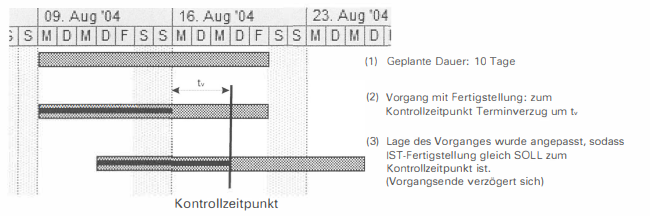
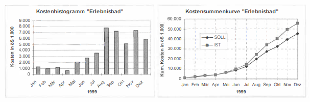

:::note
Projektcontrolling ist ein in der Literatur nicht klar definierter Begriff, jedoch lässt sich folgendes dazu sagen.
:::

Projektcontrolling ist ein funktionsübergreifendes Steuerungsinstrument, das den unternehmerischen Entscheidungs- und Steuerungsprozess in Bezug auf Projekte durch zielgerichtete Informationserarbeitung und -verarbeitung unterstützt. Dieses Controlling-Konzept zielt darauf ab, relevante Informationen über Projekte zu sammeln, zu verarbeiten und an die Entscheidungsträger im Unternehmen zu kommunizieren, um die Effizienz und den Erfolg von Projekten sicherzustellen.

## Vier Aspekte

Dabei behandelt Projektcontrolling vier wichtige Aspekte:

-   **Planung**: Vorbereitung von benötigten Ressourcen für die Erfüllung von Zielen
-   **Kontrolle**: Überwachen und Vergleichen des IST-Standes eines Projekts mit dem in der Planung festgelegten SOLL-Stand
-   **Analyse**: Herausfinden der Konsequenzen bei Abweichungen vom SOLL-Stand
-   **Steuerung**: Umsetzung anpassender Maßnahmen, damit das Projekt nicht scheitert

Es gibt hierbei viele [Methoden](#instrumente--methoden), welche den Controllern in allen vier Aspekten als Hilfe zur Verfügung stehen.

## ProjektcontrollerIn Rolle

## Instrumente / Methoden

Mit der Zeit haben sich viele Hilfemittel entwicklet, welche im Bereich Projektcontrolling Unterstützung bei den [vier Aspekten](#vier-aspekte) hilfreich sind.

### ABC Analyse

> _Durch welche Kunden erzielt unser Unternehmen den größten Umsatz?_

Ein bekannter Leitsatz lautet: "20% der Kunden machen 80% des Umsatzes aus" (Pareto-Prinzip). Es ist wichtig für das Unternehmen zu wissen, welche Kunden eine hohe Priorität in Bereichen Kundensupport, Dienstleistungen usw. bekommen. Bei Kundenunzufriendenheiten ist es wichtig, dass das Unternehmen Anfragen von den A-Kunden (die wichtigsten Kunden, welche ca. 80% des Umsatzes ausmachen) schneller löst als zum Beispiel von C-Kunden, weil sonst der A-Kunde eventuell nicht mehr Kunde ist und dem Unternehmen enorme Umsatzverluste einspielt.

### Terminkontrolle

Die regelmäßige und rechtzeitige Rückmeldung der „Ist-Termine" an den Projektleiter ist die Voraussetzung für eine wirkungsvolle Terminkontrolle. Zu jedem Arbeitspaket (Soll-Termin) ist anzugeben, ob der Termin eingehalten, überschritten oder vorverlegt wird.

#### Gründe

-   Änderung des Leistungsumfangs oder der Qualitätsanfoerungen
-   unvorhersehbare Probleme
-   unrealistische Schätzung des Aufwands
-   Personalengpässe durch Krankheit oder Ausscheiden von Teammitgliedern
-   geringe Produktivität durch schlechte Koordination, mangelnder Erfahrung oder geringer Sachkenntnis

#### Maßnahmen

-   Mobilisierung zusätzlicher Personalressourcen
-   Erhöhung der Arbeitszeit / Produktivität
-   Outsourcing / Outtasking

#### Termintreue

Als Kennzahl zur Beschreibung der Termintreue in einem Projekt können geplante Dauer und Verzug dargestellt werden.

---

### Kostenkontrolle

Eine zeitliche Kostenkontrolle hat nicht nur den Vorteil während des Projekts Kosten vermeiden zu können, sondern hilft auch zukünftigen Projekten das bessere Planen von Kosten, weil man aus der Erfahrung profitiert.

Man kann die Kosten pro Monat auflisten (Bild links), um einen schnellen Überblick über die kostenintensiven und sparsamen Monate (oder allgemein Zeiteinheiten) zu bekommen, oder man kumuliert die Kosten (Bild rechts), um einen übersichtlichen Vergleich zwischen SOLL- und IST-Kosten zu erhalten.

### Sachfortschrittskontrolle

Bei der Sachfortschrittskontrolle (auch Leistungskontrolle) geht es um die Bestimmung des erledigten Anteils eines Arbeitspaketes. Hierfür gibt es einige Vorangehensweisen:

-   **Statusschritt-Technik**
-   **50-50-Technik**: 50% erledigt, sobald das Arbeitspaket gestartet; 100%, wenn fertig
-   **0-100-Technik**: 0%, solange nicht fertig; 100%, wenn fertig; macht nur Sinn bei kleinen Arbeitspaketen
-   **Mengen-Proportionalität**: Anwendbar, wenn mess- oder zählbare Ergebniseinheiten vorliegen. Eine abgearbeitet Einheit (z.B. assemblierter PC) repräsentiert einen bestimmten Zuwachs von Fortschrittsgrad bzw. Fertigstellungswert (Earned Value, s.u.).
-   **Zeit-Proportionalität**: Für bestimmte Projekttätigkeiten, wie z.B. das Projektmanagement, für die eine „gleichmäßige Verteilung" über den gesamten Projektverlauf angenommen wird. Der Fortschrittsgrad ergibt sich aus der abgelaufenen Zeitdauer.

### Earned-Value Analyse

Der Earned-Value ist eine Kennzahl, welche bei der Bestimmung folgender Fragen hilfreich ist:

> _Liegt mein Projekt zum Kontrollzeitpunkt im **Kostenplan** oder nicht?_

-   Ja, wenn der Earned-Value höher ist als die Ist-Kosten. Das bedeutet, dass Sie innerhalb des Budgets liegen oder sogar darunter.
-   Nein, wenn der Earned-Value niedriger ist als die Ist-Kosten. In diesem Fall überschreiten Sie das Budget und Ihr Projekt liegt kostenmäßig "hinten".

> _Liegt mein Projekt zum Kontrollzeitpunkt im **Zeitplan** oder nicht?_

-   Ja, wenn der Earned-Value höher ist als die Plankosten. Das bedeutet, dass Sie mehr Fortschritt erzielt haben, als ursprünglich geplant, und Ihr Projekt liegt zeitlich "vorne".
-   Nein, wenn der Earned-Value niedriger ist als die Plankosten. In diesem Fall haben Sie weniger Fortschritt erzielt als geplant, und Ihr Projekt liegt zeitlich "hinten".

## Controlling Prozess

## Mögliche Quellen für Abweichungen

## Notwendigkeit
