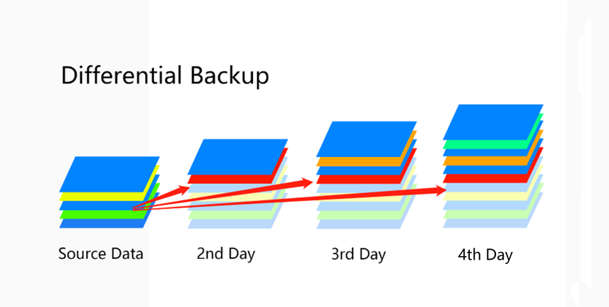

Im privaten Bereicht gibt es keine Verpflichtung für die Datensicherung. Was Sie mit Ihren Daten machen, kann jedem anderen Menschen eigentlich recht egal sein. Doch bei Unternehmen sieht das anders aus. Unternehmen müssen eine Buchhaltung führen, für welche es die Pflicht gibt, Rechnungen sieben Jahre lang aufzubewahren. Und wenn Unternehmen Rechnungen digital führen wollen, dann müssen diese Rechnungen strategisch gesichert sein. Sonst kann es schnell passieren, dass aufgrund einer exzessiven redundanten Sicherung der Platz ausgeht oder die Daten verloren gehen.

:::note[zusätzliche Information]
Bei Unternehmen gibt es sogenannte ISO-Zertifizierungen, welche dazu dienen eine gewisse Qualität voraus zu setzen. Diese ISO-Normen definieren gewisse Bereiche und sind in alle Sektoren (Umwelt, IT, Qualität, Gebrauchsgüter, Ernährung, Medizin, ...). Beispiel für ISO-Normen sind:

-   9000: Qualitätsmanagement
-   14000: Umweltmanagement
-   27000: IT-Sicherheit

:::

## Strategien

Um eine Sicherung möglichst effizient betreiben zu können, gibt es einige Strategien, welche bei der Aufsetzung eines Backups hilfreich sind.

### Kommunikation

Vorab ist es wichtig zu erwähnen, dass nicht nur IT-Mitarbeiter über die Sicherung Bescheid wissen sollen. Es ist essenziell, dass alle Mitarbeit des Unternehmens wissen, welche Daten gesichert werden. Somit kann man den Mitarbeitern die Verantwortung übergeben, Daten am richtigen Speicherplatz abzulegen, damit diese auch gesichert werden.

### Durchführung - Wie?

Es gibt verschiedene Möglichkeiten, auf welche Art man die Daten sichern will. Je nach Art ist der Aufwand unterschiedlich hoch, dafür ändert sich allerdings der Speicherbedarf. Außerdem muss man sich überlegen, ob man nur bestimmte Daten oder das gesamte Betriebssystem sichern will.

#### Vollständige Sicherung

Bei einer vollständigen (oder kompletten) Sicherung macht man eine 1:1 Kopie des Mediums. Deswegen hat man einen hohen Speicherbedarf, wenn zum Beispiel täglich immer alle Daten erneut gesichert werden. Nach einer Woche, benötigt die Sicherung bereits zirka sieben Mal so viel Platz, wie die Daten selbst. Allerdings hat man den Vorteil, einen geringen Aufwand beim Sichern und beim Wiederherstellen zu haben.

#### Differentielle Sicherung

Bei einer differentiellen Sicherung macht man regelmäßig eine Komplettsicherung und dazwischen in gewissen Zeitabständen immer eine Teilsicherung mit allen Änderungen zur letzten **Komplettsicherung**. Beispielsweise sichert man wöchentlich alles erneut (vollständig) und täglich die Veränderung seit Wochenanfang (Differenz).

#### Inkrementelle Sicherung

Bei einer inkrementellen Sicherung macht man regelmäßig eine Komplettsicherung und dazwischen in gewissen Zeitabständen eine Teilsicherung relativ zur letzten **Teilsicherung**. Beispielsweise sichert man wöchentlich alles erneut (vollständig) und täglich die Veränderung zum Vortag (Inkrement).

#### Generationenprinzip

Das Generationenprinzip ist eine geprüfte Sicherungsstrategie, welches folgendes Problem löst:

> Bei einer Sicherung will man den Speicherplatz optimal nutzen und trotzdem Daten, welche sich täglich verändern und wachsen, speichern können. Wie kann ich beide Faktoren möglichst stark optimieren?

Zuerst beantworten wir die Frage, was eine Generation in diesem Zusammenhang ist. Man spricht von einer neuen Generation, wenn diese eine Komplettsicherung aller zeitlich vorherigen Sicherungen aus vorherigen Generationen ist. Wie man in dem untigen Bild erkennen kann ist `V1` (Freitag, 5. Jänner) eine neue Generation, da diese Sicherung alle Daten der Sicherungen `S1` - `S4` (1. - 4. Jänner) beinhaltet. Aus diesem Grund kann am 8. Jänner die Sicherung vom 1. Jänner überschrieben werden (gleiche Zeilen bedeuten gleiche Festplatten).

Um das Prinzip nun fachlich zu formulieren:

> In logarithmischen Abständen werden neue Generationen erstellt. Bei jeder Sicherung in eine höhere Generation werden alle Daten der darunterliegenden Generationen zu einer Vollsicherung zusammengefasst.

Aufgrund dieser logarithmischen Eigenschaft, kann das Generationenprinzip theoretisch zeitlich unendlich lange angewandt werden ohne viel mehr Speicherplatz zu benötigen. Das Generationenprinzip ist nicht an einen speziellen Sicherungstyp (vollständig, differenziell, inkrementell) gebunden.

### Verantwortlichkeit - Wer?

Eine Sicherung macht sich nicht von alleine. In einem Unternehmen sollte genau eingeteilt sein, welche(r) Mitarbeiter für die Sicherung verantwortlich ist und diese gewissenhaft durchführt. Diese Person(en) kümmert sich um die Datenmedien (z. B.: Helpdesk, Funktion, ...). Im Unternehmen muss außerdem jeder Mitarbeit darüber Bescheid wissen, was und wann gesichert wird ([Kommunikation](#kommunikation)).

### Zeitplan - Wann?

Bei einer Sicherung muss man sich vorab überlegen, in welchen Abständen man sichern will. Meistens macht es Sinn, täglich zu sichern. Außerdem muss klar definiert sein, um welche Uhrzeit gesichert wird. Am sinnvollsten sind Uhrzeiten, in denen die wenigsten Mitarbeiter arbeiten. Dies ist meistens nachts, es sei denn, man betreibt die Sicherung in einem Spital.

### Speicherort - Wo?

Es ist wichtig, sich zu überlegen, ob die Sicherung in einem eigenen Raum oder sogar in einem eigenen Gebäude durchführt und aufbewahrt werden soll. Je weiter die Sicherung geografisch von der Verwendung der Daten entfernt ist, desto sicherer sind die gesicherten Daten gegen physische Gefahren, wie zum Beispiel Feuer oder Wasser geschützt.

Des Weiteren muss besprochen werden, ob die Sicherung in einen Datensicherheitsschrank gesichert wird oder andere Aufbewahrungsmöglichkeiten mehr Sinn machen.

### Aufbewahrungsdauer - Wie lange?

Unternehmen müssen Daten laut Gesetz mindestens sieben Jahre aufbewahren. Ob jedoch alle dieser Daten oder nur bestimmte Rechnungen für einen so langen Zeitraum aufgehoben werden müssen, muss abgeklärt werden.

### Datenidentifikation - Welche Daten?

In den meisten Fällen macht es Sinn, reine Nutzdaten zu sichern und das Betriebssystem und Programme nicht mit zu sichern. Um eine effiziente Sicherung durchführen zu können, wird empfohlen mit mehreren Mitarbeitern zu kommunizieren, um herauszufinden, welche Datentypen gesichert werden müssen. Denn viele Backup-Systeme unterstützen auch die Einschränkung auf Dateiendungen.

### Speichermedium - Welches Medium?

Sicherungen werden meistens für längere Zeiträume aufbewahrt, weshalb Magnetbänder mehr Sinn machen, als einfache SSDs oder Datenbänder. Jedoch kann diese Entscheidung - sowie jede andere Strategie - von Fall zu Fall variieren.

### Verschlüsselung

Stellen Sie sich die Frage, ob eine Verschlüsselung notwendig ist oder nicht. Wenn ja, welche Verschlüsselung verwenden Sie?

### Wiederherstellung

Es ist wirklich wichtig, regelmäßig zu testen, ob die Sicherung auch wiederhergestellt werden kann. Des Weiteren sollten Sie die Funktionalität der wiederhergestellten Dateien ausprobieren. Wenn Sie diese Testung nicht durchführen, kann es sein, dass die gesamte Sicherung und der verbundene Aufwand umsonst gewesen ist. Ein empfohlener Zeitabstand für diese Testung beträgt ein Jahr.
