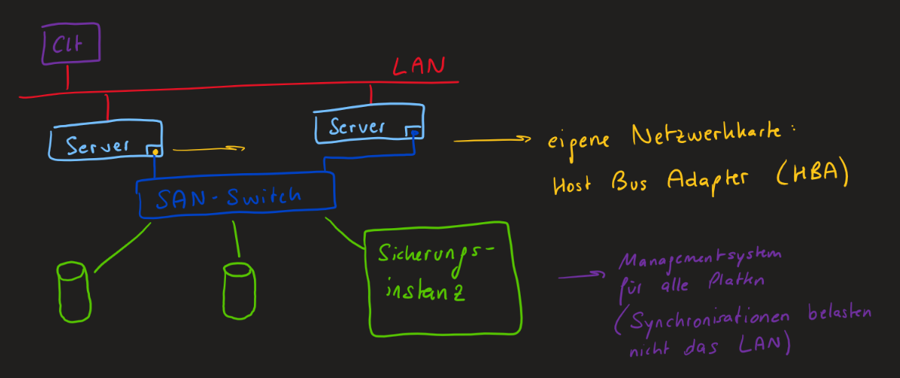

Professionelle Speichersysteme sind meistens eine zentrale Speicherlösung, damit alle Nutzer in einem Netzwerk auf diesen Speicher zugreifen können. Bei solchen Speichersystemen liegt am Host kein Speichersystem, sondern alles nur auf Virtuellen Maschinen.

## NAS

NAS steht für Network Attatched Storage und ist eine einfache Möglichkeit in Netzwerken einen zentralen Speicherplatz für alle Nutzer aufzubauen. Dabei ist das NAS ein eigener Rechner mit Betriebssystem, wobei dieses Betriebssystem die Speicherverwaltung übernimmt und die Dateifreigabe verwaltet.

### Funktionalitäten

-   **RAID**  
    Damit die Daten redundant gespeichert sind, unterstützt NAS out of the box bereits RAID. Dieses kann sowohl nur auf Softwareebene, also auch auf Hardwareebene umgesetzt werden. Bei letzterem unterstützt NAS sogar das Speichern auf unterschiedlichen physischen Platten (NAT-Boxen).

-   **Berechtigungsverwaltung**  
    NAS hat zusätzlich auch noch direkt eine Verwaltung für verschiedene Benutzer integriert.

### Anbieter

-   OpenMediaVault (Software)
-   XigmaNAS (Software)
-   Synology (Hardware): stellt eigene Server speziell für die Speicherung von Daten her

### Vorteile

-   **Einfache Integration**  
    NAS-Geräte sind einfach in bestehende Netzwerke zu integrieren. Sie fungieren als eigenständige Server und sind über das Netzwerk zugänglich.

-   **Einfache Verwaltung**  
    Die Verwaltung von NAS ist in der Regel benutzerfreundlich und erfordert keine speziellen Kenntnisse im Bereich Storage Networking. Die Konfiguration erfolgt oft über eine Web-Benutzeroberfläche.

-   **Kostengünstig für kleinere Umgebungen**  
    NAS-Systeme sind oft kostengünstiger als SAN-Systeme und daher gut für kleinere Unternehmen oder Heimnetzwerke (`SOHO`) geeignet.

-   **Berechtigungsverwaltung**  
    NAS hat standardmäßig bereits eine Verwaltung für verschiedene Benutzer integriert.

### Nachteile

-   **Begrenzte Leistung**  
    Im Vergleich zu SAN bieten NAS-Geräte oft eine begrenzte Leistung, insbesondere bei intensiven Anwendungen wie Datenbanken oder Virtualisierung.

-   **Skalierbarkeit**  
    NAS kann bei wachsendem Bedarf an Speicherplatz und Leistung an seine Grenzen stoßen. Die Skalierbarkeit kann durch die begrenzte Anzahl unterstützter Festplatten beeinträchtigt werden.

-   **Belastung des LAN**  
    Da alle Daten über das Unternehmensnetzwerk gesendet werden und diese Dateien meistens große Daten sind, entstehen viele Pakete, welche das Unternehmensnetzwerk sehr belasten. Außerdem haben diese Pakete aufgrund der Fragmentiertung viel Overhead.

## SAN

SAN steht für Storage Area Network und ist die High-End Variante von zentralen Speichersystemen. Im Gegensatz zu NAS gibt es nämlich bei SAN ein eigenes Netzwerk, in welchem auf verschiedenen Servern die Daten abgelegt werden. Dies hat den Vorteil, dass bei einer Synchronisation der Sicherungsinstanzen kein zusätzlicher Netzverkehr anfällt, da dieser Verkehr vom Unternehmensnetzwerk abgeschottet ist.

Wie man im Bild sehen kann, haben die Server eigenen Netzwerkkarten, um auf den Speicher zugreifen zu können. Aufgrund der `Host Bus Adapter (HBA)` glauben die Server, dass die Speicherplatten direkt an ihn angeschlossen sind. Das gesamte SAN ist für die Server also transparent.

:::note[Hinweis]
Bei einem SAN-System ist es empfehlenswert, alle Komponenten von einem Hersteller zu kaufen (`SINGLE VENDOR`).
:::

### Vorteile

-   **Eigenes Netzwerk**  
    Das N in SAN steht für Network. Dies bedeutet, dass bei SAN ein eigenes Netzwerk für die Verwaltung der Speichermedien existiert. Dadurch ist das Unternehmensnetzwerk nicht überlastet und Speichermedien können sich an verschiedenen Standorten befinden.

-   **Hohe Leistung**  
    SAN bietet in der Regel eine höhere Leistung als NAS, insbesondere bei blockbasierten Datenzugriffen. Es ist ideal für Anwendungen mit hohen Leistungsanforderungen, wie z. B. Datenbanken.

-   **Skalierbarkeit**  
    SAN-Systeme sind hoch skalierbar und können leicht an wachsende Speicheranforderungen angepasst werden. Dies macht sie gut geeignet für große Unternehmen mit umfangreichen Datenmengen.

-   **Blockbasierte Speicherung**  
    SAN arbeitet auf Blockebene und ermöglicht so den direkten Zugriff auf Speicherblöcke. Dies ist besonders vorteilhaft für Anwendungen, die blockbasierte Datenzugriffe erfordern.

### Nachteile

-   **Kosten**  
    SAN-Systeme sind in der Regel teurer als NAS, sowohl in Bezug auf die Hardware als auch auf die Implementierung.

-   **Komplexität**  
    Die Einrichtung und Verwaltung von SAN erfordert spezielle Kenntnisse im Bereich Storage Networking. Dies macht SAN in der Regel komplexer als NAS.

-   **eingeschränkte Dateifreigabe**  
    Im Vergleich zu NAS ist SAN weniger gut geeignet für die gemeinsame Nutzung von Dateien in einem Netzwerk, da es hauptsächlich auf blockbasierten Datenzugriff ausgerichtet ist.

## DAN

Der Direct Attatched Storage ist einfach eine Festplatte direkt im PC verbaut.
